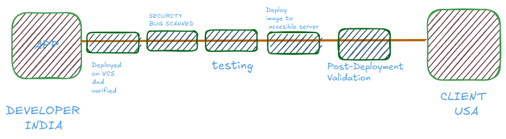

# DEVOPS

## The CI/CD concept



CONTINOUS INTEGRATION                                 CONT. DELIVERY                              CONT. DIPLOYMENT


### CI(CONTINUOUS INTEGRATION)

**Challenges of Isolated Development**

- Extended isolation leads to **difficult merges**, conflicts, and increased **bug accumulation**.
- Bugs are detected **late in the development cycle**, delaying fixes.
- Difficulties in integrating updates **slow down delivery to customers**

### CI is used for :

- **Frequent commits** to a shared repository prevent large, complex merges.
- CI pipelines **automate builds, store artifacts, run unit tests**, and perform **code reviews** .
- The pipeline can be **triggered on every commit or merge**, ensuring **fast feedback loops**.
- Early bug detection improves **code quality and software reliability**.

Successful CI means that once a developer’s changes to an application are merged, those changes are validated by automatically building the application and running different levels of automated testing, typically unit and integration tests, to ensure the changes haven’t broken the app. This means testing everything from classes and function to the different modules that comprise the entire app. One of the benefits of CI is that if automated testing discovers a conflict between new and existing code, it is easier to fix those bugs quickly and often.


# How Most Of Firms Works?


## CD(Continuous DELIVERY/DEPLOYMENT)

This is the next step in the hosting of our developed application or functionality.

### **Continuous Delivery (CD)**

- **Definition**: Continuous Delivery is the practice of automatically packaging and delivering your application (e.g., as a Docker image, `.zip`, `.jar`, etc.) to a **staging or testing environment** after each successful integration (CI).
- **Key Point**: The delivery is **automated**, but the **deployment to production is manual**. This allows teams to push changes frequently and reliably, while still maintaining a final approval step before going live.
- **Example**: Code is built and tested, then deployed to a test server for QA. A release manager can then manually trigger the production deployment.
- **Precondition**: A proper **CI pipeline** must already be in place to ensure every change is tested and validated before being delivered.

### **Continuous Deployment (CD)**

- **Definition**: Continuous Deployment takes things one step further — it **automatically deploys every change that passes tests directly to production**, with **no manual intervention**.
- **What does this mean?** It means every commit that passes automated testing and quality gates is **immediately visible to end users**.
- **Key Requirement**: This process **does not skip testing** — rather, all **testing must be automated and robust enough** to catch any issues before production. If any test fails, the pipeline halts and the change is not deployed.
- **Benefits**:
    - Extremely fast delivery of features.
    - Short feedback loops.
    - High agility for development teams.
- **Risks**:
    - Requires strong automated testing and observability (monitoring, alerting, logging).
    - A bug in production can happen quickly if quality gates are weak.

In essence ,

- **Continuous Delivery** focuses on ensuring that every code change is automatically built, tested, and **prepared for release**. The deployment to production still requires **manual approval** after testing in a staging environment.
- **Continuous Deployment** automates **the entire release pipeline** — from code commit to production deployment — as long as all **automated tests pass**. There's **no manual intervention** between staging and live environments.

## WORKING OF CI/CD


This increases the efficiency of Application!

NOW THIS IS HOW A MULTI-INFRA CI/CD WORKS:


# JENKINS

### —> JOBS:

A Jenkins job encapsulates a specific task or process within the CI/CD pipeline. Whether it's compiling source code, running tests, or deploying applications, Jenkins jobs define and execute these tasks automatically. When configuring a Jenkins job, users encounter a variety of fields, each serving a distinct purpose in defining job behavior and characteristics.

TYPES OF JOBS:


## CREATING A JOB

—>Discard old builds: 

This determines when, if ever, build records for this project should be discarded. Build records include the console output, archived artifacts, and any other metadata related to a particular build.

Keeping fewer builds means less disk space will be used in the *Build Record Root Directory* , which is specified on the *Configure System* screen.

Jenkins offers two options for determining when builds should be discarded:

1. Build age: discard builds when they reach a certain age; for example, seven days old.
2. Build count: discard the oldest build when a certain number of builds already exist.

These two options can be active at the same time, so you can keep builds for 14 days, but only up to a limit of 50 builds, for example. If either limit is exceeded, then any builds beyond that limit will be discarded.

You can also ensure that important builds are kept forever, regardless of the setting here — click the *Keep this build forever* button on the build page.

The last stable and last successful build are also excluded from these rules.

---

In the *Advanced* section, the same options can be specified, but specifically for build **artifacts**. If enabled, build artifacts will be discarded for any builds which exceed the defined limits. The builds themselves will still be kept; only the associated artifacts, if any, will be deleted. For example, if a project builds some software and produces a large installer, which is archived, you may wish to always keep the console log and information about which source control commit was built, while for disk space reasons, you may want to keep only the last three installers that were built.

This can make sense for projects where you can easily recreate the same artifacts later by building the same source control commit again.

---

Note that Jenkins does not discard items immediately when this configuration is updated, or as soon as any of the configured values are exceeded; these rules are evaluated each time a build of this project completes.


-

So here we have something  called AGENTS which are acting as end nodes this means that the jenkins will setup the job and the job is distributed to the agent node.


It is not must to install jenkins to slave nodes we much have java in agents!

## CREATING JENKINS AGENTS:


## GITHUB WEBHOOKS:

Now if we update some thing on our developement build code on github and we want it to automatically updated on the JENKINS Server we can do this by using GiT  WEBHOOKS.


### CREDENTIALS BINDING:

While pushing our image or code to dockerhub or any other repo services we need to hide our credentials in .env variable so that no one can get it. For this same we have a technique called credential binding.

Here am showing dockerhub connection with jenkins using credential binding:

Here we are at this path/


After this click on add credentials:


Now here we have to enter our username and password—> in place of original password we will enter a dummy personal access token from dockerhub .

Go to account settings in docker hub—>


Click on generate new token….


Now use that token as a password!

# KUBERNETES(K8s)

**Kubernetes is a distributed system for declaratively managing containerized applications across clusters of machines with self-healing, autoscaling, load balancing, rolling updates, and infrastructure abstraction.**

### What Kubernetes Does for You:

- Ensures **desired state**: You declare what you want; K8s makes it happen.
- **Self-healing**: Restarts crashed pods, reschedules on failed nodes.
- **Scaling**: Horizontal and vertical pod autoscaling.
- **Rolling Updates / Rollbacks**
- **Load balancing** across services
- **Storage orchestration** (dynamic provisioning)
- **Service discovery** and internal DNS
- **Secret and config management**
- **Multi-tenancy** via namespaces and RBAC

It works on micro-services.

## MONOLITHIC vs MICRO-SERVICES

**In monolithic all the content of a software, an application stays at only a single location.**


Interdependency is very much larger if one of the component fails the software shuts down!

I**n micro-services a big load of application or software is broken down in tiny chunks of services like database, front-end ,back-end and etc…**


IF one of service stops, impact and working is only done on that rest will remain same.

# ARCHITECTURE OF KUBERNETES


**A master node controlling all other worker nodes in a cluster and doing the pre-requisite work assigned.**


- **API SERVER:**  It is the communication gateway between master and worker nodes.
- **Scheduler:** To schedule and run the pods.
- **ETCD**: It is a key value datastore ,it stores everything running in our  k8s.
- **Controller manager:**  Look for everything whether is working fine or not.
- **Kubelet** : Can register node’s to apiserver and check whether everything is running fine or not.
- **service proxy**:  used for accessing the internal pods as a user from outside the node.
- **kubectl**: Kubernetes head which gave instructions of what to.

**CNI** = *Container Network Interface*.

It's a **specification + plugin system** that lets Kubernetes (via Kubelet) configure network interfaces for pods in a modular way.

Kubernetes doesn’t implement networking itself. Instead, it **delegates** pod network setup to CNI **plugins** (Flannel, Calico, Cilium, Weave, etc.).

**TYPES OF CLUSTUR DISTROS**

| Distribution | Type | Features / Notes |
| --- | --- | --- |
| **EKS** | Managed (AWS) | AWS-hosted control plane; integrates with IAM, VPC, ELB |
| **GKE** | Managed (GCP) | Google's flavor; automatic upgrades, auto-repair, Stackdriver |
| **AKS** | Managed (Azure) | Azure flavor; integrates with AAD, Log Analytics |
| **OpenShift** | Self-hosted | Red Hat’s enterprise K8s + security/hardening + developer tools |
| **Rancher** | Self-hosted | Multi-cluster manager + K3s/RKE |
| **K3s** | Lightweight | Super minimal K8s (<100MB binary) for edge/IoT/dev |
| **Minikube** | Local Dev | For local dev/testing. Spins up VM with K8s. |
| **kind** | Local Dev | “Kubernetes IN Docker” — great for CI pipelines |
| **kOps** | Self-hosted | CLI tool to install K8s on AWS |
| **MicroK8s** | Local/Edge | Canonical’s all-in-one binary with snap install |
| **Tanzu** | Enterprise | VMware’s Kubernetes platform |
| **Anthos** | Hybrid | Google’s hybrid cloud platform |

### [**kind**](https://sigs.k8s.io/kind)


**is a tool for running local Kubernetes clusters using Docker container “nodes”.**

**kind was primarily designed for testing Kubernetes itself, but may be used for local development or CI.**

# KIND Cluster Setup Guide

## 1. Installing KIND and kubectl

Install KIND and kubectl using the provided [script](https://github.com/LondheShubham153/kubestarter/blob/main/kind-cluster/install.sh):

## 2. Setting Up the KIND Cluster

Create a kind-config.yaml file:

```yaml

kind: Cluster
apiVersion: kind.x-k8s.io/v1alpha4
nodes:
  - role: control-plane
    image: kindest/node:v1.33.1
  - role: worker
    image: kindest/node:v1.33.1
  - role: worker
    image: kindest/node:v1.33.1

```

Create the cluster using the configuration file:

```bash

kind create cluster --config kind-config.yaml --name tws-kind-cluster

```

Verify the cluster:

```bash

kubectl get nodes
kubectl cluster-info

```

## 3. Accessing the Cluster

Use kubectl to interact with the cluster:

```bash

kubectl cluster-info

```

## 4. Setting Up the Kubernetes Dashboard

Deploy the Dashboard
Apply the Kubernetes Dashboard manifest:

```bash

kubectl apply -f <https://raw.githubusercontent.com/kubernetes/dashboard/v2.7.0/aio/deploy/recommended.yaml>

```

Create an Admin User
Create a dashboard-admin-user.yml file with the following content:

```yaml

apiVersion: v1
kind: ServiceAccount
metadata:
  name: admin-user
  namespace: kubernetes-dashboard
---
apiVersion: rbac.authorization.k8s.io/v1
kind: ClusterRoleBinding
metadata:
  name: admin-user
roleRef:
  apiGroup: rbac.authorization.k8s.io
  kind: ClusterRole
  name: cluster-admin
subjects:
- kind: ServiceAccount
  name: admin-user
  namespace: kubernetes-dashboard

```

Apply the configuration:

```bash

kubectl apply -f dashboard-admin-user.yml

```

Get the Access Token
Retrieve the token for the admin-user:

```bash

kubectl -n kubernetes-dashboard create token admin-user

```

Copy the token for use in the Dashboard login.

Access the Dashboard
Start the Dashboard using kubectl proxy:

```bash

kubectl proxy

```

Open the Dashboard in your browser:

```bash

<http://localhost:8001/api/v1/namespaces/kubernetes-dashboard/services/https:kubernetes-dashboard:/proxy/>

```

Use the token from the previous step to log in.

## 5. Deleting the Cluster

Delete the KIND cluster:

```bash

kind delete cluster --name my-kind-cluster

```

## 6. Notes

Multiple Clusters: KIND supports multiple clusters. Use unique --name for each cluster.
Custom Node Images: Specify Kubernetes versions by updating the image in the configuration file.
Ephemeral Clusters: KIND clusters are temporary and will be lost if Docker is restarted.

### **Kubeadm Installation Guide**

This guide outlines the steps needed to set up a Kubernetes cluster using `kubeadm`.

**Prerequisites**

- Ubuntu OS (Xenial or later)
- `sudo` privileges
- Internet access
- t2.medium instance type or higher

---

**AWS Setup**

1. Ensure that all instances are in the same **Security Group**.
2. Expose port **6443** in the **Security Group** to allow worker nodes to join the cluster.
3. Expose port **22** in the **Security Group** to allows SSH access to manage the instance..

**To do above setup, follow below provided steps**

**Step 1: Identify or Create a Security Group**

1. **Log in to the AWS Management Console**:
    - Go to the **EC2 Dashboard**.
2. **Locate Security Groups**:
    - In the left menu under **Network & Security**, click on **Security Groups**.
3. **Create a New Security Group**:
    - Click on **Create Security Group**.
    - Provide the following details:
        - **Name**: (e.g., `Kubernetes-Cluster-SG`)
        - **Description**: A brief description for the security group (mandatory)
        - **VPC**: Select the appropriate VPC for your instances (default is acceptable)
4. **Add Rules to the Security Group**:
    - **Allow SSH Traffic (Port 22)**:
        - **Type**: SSH
        - **Port Range**: `22`
        - **Source**: `0.0.0.0/0` (Anywhere) or your specific IP
    - **Allow Kubernetes API Traffic (Port 6443)**:
        - **Type**: Custom TCP
        - **Port Range**: `6443`
        - **Source**: `0.0.0.0/0` (Anywhere) or specific IP ranges
5. **Save the Rules**:
    - Click on **Create Security Group** to save the settings.

**Step 2: Select the Security Group While Creating Instances**

- When launching EC2 instances:
    - Under **Configure Security Group**, select the existing security group (`Kubernetes-Cluster-SG`)

> Note: Security group settings can be updated later as needed.
> 

---

**Execute on Both "Master" & "Worker" Nodes**

- **Disable Swap**: Required for Kubernetes to function correctly.
    
    ```
    sudo swapoff -a
    ```
    

**Load Necessary Kernel Modules**: Required for Kubernetes networking.

```
cat <<EOF | sudo tee /etc/modules-load.d/k8s.conf
overlay
br_netfilter
EOF

sudo modprobe overlay
sudo modprobe br_netfilter
```

**Set Sysctl Parameters**: Helps with networking.

```
cat <<EOF | sudo tee /etc/sysctl.d/k8s.conf
net.bridge.bridge-nf-call-iptables  = 1
net.bridge.bridge-nf-call-ip6tables = 1
net.ipv4.ip_forward                 = 1
EOF

sudo sysctl --system
lsmod | grep br_netfilter
lsmod | grep overlay
```

**Install Containerd**:

```
sudo apt-get update
sudo apt-get install -y ca-certificates curl
sudo install -m 0755 -d /etc/apt/keyrings
sudo curl -fsSL https://download.docker.com/linux/ubuntu/gpg -o /etc/apt/keyrings/docker.asc
sudo chmod a+r /etc/apt/keyrings/docker.asc

echo "deb [arch=$(dpkg --print-architecture) signed-by=/etc/apt/keyrings/docker.asc] https://download.docker.com/linux/ubuntu $(. /etc/os-release && echo \"$VERSION_CODENAME\") stable" | sudo tee /etc/apt/sources.list.d/docker.list > /dev/null

sudo apt-get update
sudo apt-get install -y containerd.io

containerd config default | sed -e 's/SystemdCgroup = false/SystemdCgroup = true/' -e 's/sandbox_image = "registry.k8s.io\/pause:3.6"/sandbox_image = "registry.k8s.io\/pause:3.9"/' | sudo tee /etc/containerd/config.toml

sudo systemctl restart containerd
sudo systemctl status containerd
```

**Install Kubernetes Components**:

```
sudo apt-get update
sudo apt-get install -y apt-transport-https ca-certificates curl gpg

curl -fsSL https://pkgs.k8s.io/core:/stable:/v1.29/deb/Release.key | sudo gpg --dearmor -o /etc/apt/keyrings/kubernetes-apt-keyring.gpg

echo 'deb [signed-by=/etc/apt/keyrings/kubernetes-apt-keyring.gpg] https://pkgs.k8s.io/core:/stable:/v1.29/deb/ /' | sudo tee /etc/apt/sources.list.d/kubernetes.list

sudo apt-get update
sudo apt-get install -y kubelet kubeadm kubectl
sudo apt-mark hold kubelet kubeadm kubectl
```

**Execute ONLY on the "Master" Node**

- **Initialize the Cluster**:
    
    ```
    sudo kubeadm init
    ```
    

**Set Up Local kubeconfig**:

```
mkdir -p "$HOME"/.kube
sudo cp -i /etc/kubernetes/admin.conf "$HOME"/.kube/config
sudo chown "$(id -u)":"$(id -g)" "$HOME"/.kube/config
```

**Install a Network Plugin (Calico)**:

```
kubectl apply -f https://raw.githubusercontent.com/projectcalico/calico/v3.26.0/manifests/calico.yaml
```

**Generate Join Command**:

```
kubeadm token create --print-join-command
```

> Copy this generated token for next command.
> 

---

**Execute on ALL of your Worker Nodes**

- Perform pre-flight checks:
    
    ```
    sudo kubeadm reset pre-flight checks
    ```
    

Paste the join command you got from the master node and append `--v=5` at the end:

```
sudo kubeadm join <private-ip-of-control-plane>:6443 --token <token> --discovery-token-ca-cert-hash sha256:<hash> --cri-socket
"unix:///run/containerd/containerd.sock" --v=5
```

**Note**: When pasting the join command from the master node:

1. Add `sudo` at the beginning of the command
2. Add `-v=5` at the end

Example format:

```
sudo <paste-join-command-here> --v=5
```

---

**Verify Cluster Connection**

**On Master Node:**

```
kubectl get nodes

```


---

**Verify Container Status on Worker Node**


# Minikube Installation Guide for Ubuntu

This guide provides step-by-step instructions for installing Minikube on Ubuntu. Minikube allows you to run a single-node Kubernetes cluster locally for development and testing purposes.

## Pre-requisites

- Ubuntu OS
- sudo privileges
- Internet access
- Virtualization support enabled (Check with `egrep -c '(vmx|svm)' /proc/cpuinfo`, 0=disabled 1=enabled)

---

## Step 1: Update System Packages

Update your package lists to make sure you are getting the latest version and dependencies.

```bash
sudo apt update

```

<kbd>

[image](https://github.com/paragpallavsingh/kubernetes-kickstarter/assets/40052830/57f1c5d9-474a-43b8-90b9-fe542e122f3f)

</kbd>

## Step 2: Install Required Packages

Install some basic required packages.

```bash
sudo apt install -y curl wget apt-transport-https

```

<kbd>

[image](https://github.com/paragpallavsingh/kubernetes-kickstarter/assets/40052830/84ad8474-8d4d-4d4b-a04d-def88f76dc9a)

</kbd>

---

## Step 3: Install Docker

Minikube can run a Kubernetes cluster either in a VM or locally via Docker. This guide demonstrates the Docker method.

```bash
sudo apt install -y docker.io

```

<kbd>

[image](https://github.com/paragpallavsingh/kubernetes-kickstarter/assets/40052830/d261f75b-a22f-4510-b3a3-14e1cecaf3e1)

</kbd>

Start and enable Docker.

```bash
sudo systemctl enable --now docker

```

Add current user to docker group (To use docker without root)

```bash
sudo usermod -aG docker $USER && newgrp docker

```

Now, logout (use `exit` command) and connect again.

---

## Step 4: Install Minikube

First, download the Minikube binary using `curl`:

```bash
curl -Lo minikube <https://storage.googleapis.com/minikube/releases/latest/minikube-linux-amd64>

```

Make it executable and move it into your path:

```bash
chmod +x minikube
sudo mv minikube /usr/local/bin/

```

<kbd>

[image](https://github.com/paragpallavsingh/kubernetes-kickstarter/assets/40052830/80e8a137-286a-4334-886b-ea4821f596b2)

</kbd>

---

## Step 5: Install kubectl

Download kubectl, which is a Kubernetes command-line tool.

```bash
curl -LO "<https://dl.k8s.io/release/$>(curl -L -s <https://dl.k8s.io/release/stable.txt>)/bin/linux/amd64/kubectl"

```

**Check above image ⬆️**
Make it executable and move it into your path:

```bash
chmod +x kubectl
sudo mv kubectl /usr/local/bin/

```

<kbd>

[image](https://github.com/paragpallavsingh/kubernetes-kickstarter/assets/40052830/cdda6c84-f6c9-4d05-87e0-ed8627e46a3a)

</kbd>

---

## Step 6: Start Minikube

Now, you can start Minikube with the following command:

```bash
minikube start --driver=docker --vm=true

```

This command will start a single-node Kubernetes cluster inside a Docker container.

---

## Step 7: Check Cluster Status

Check the cluster status with:

```bash
minikube status

```

<kbd>

[image](https://github.com/paragpallavsingh/kubernetes-kickstarter/assets/40052830/a2dabec8-b073-4e1e-a831-dd6845000230)

</kbd>

You can also use `kubectl` to interact with your cluster:

```bash
kubectl get nodes

```

---

## Step 8: Stop Minikube

When you are done, you can stop the Minikube cluster with:

```bash
minikube stop

```

---

## Optional: Delete Minikube Cluster

If you wish to delete the Minikube cluster entirely, you can do so with:

```bash
minikube delete

```

---

That's it! You've successfully installed Minikube on Ubuntu, and you can now start deploying Kubernetes applications for development and testing.

# **NAMESPACE**

**Namespaces in Kubernetes are virtual clusters within a physical cluster. They are used to logically isolate resources, users, and workloads within the same K8s cluster.**


### What Gets Namespaced?

**Namespaced:**

- Pods
- Services
- Deployments, StatefulSets, ReplicaSets
- ConfigMaps, Secrets
- Ingress, NetworkPolicy
- RoleBindings, ResourceQuotas

**NOT Namespaced (cluster-scoped):**

- Nodes
- PersistentVolumes
- ClusterRoles
- StorageClasses
- CustomResourceDefinitions (CRDs)

SOME OF COMMANDS:

```bash
#List all namespaces
kubectl get namespaces
#List all pods in a specific namespace
kubectl get pods -n <namespace>
#Set default namespace for your current context
kubectl config set-context --current --namespace=<namespace>
#Create a new namespace
kubectl create namespace dev
#Use a namespace temporarily for a single command
kubectl get svc -n dev

```

```bash
# =====================
# NAMESPACES
# =====================

# List all namespaces
kubectl get namespaces

# List all pods in a specific namespace
kubectl get pods -n <namespace>

# Set default namespace for your current context
kubectl config set-context --current --namespace=<namespace>

# Create a new namespace
kubectl create namespace dev

# Use a namespace temporarily for a single command
kubectl get svc -n dev

# Get all the pods across namespaces
kubectl get pods -A

# Create namespace 'nginx' for running pods
kubectl create namespace nginx

# Get interactive shell in a pod
kubectl exec -it -n nginx nginx -- /bin/bash

# =====================
# CLUSTER RELATED COMMANDS
# =====================

kubectl cluster-info
kubectl version --short
kubectl get nodes
kubectl describe node <node-name>

# =====================
# POD RELATED COMMANDS
# =====================

kubectl get pods -A
kubectl get pods -n kube-system
kubectl run nginx --image=nginx
kubectl get pod nginx
kubectl describe pod nginx
kubectl delete pod nginx

# =====================
# DEPLOYMENT COMMANDS
# =====================

kubectl create deployment myapp --image=nginx
kubectl expose deployment nginx --port=80 --type=NodePort
kubectl get deployments
kubectl scale deployment myapp --replicas=3
kubectl rollout status deployment myapp
kubectl rollout undo deployment myapp
kubectl delete deployment myapp

# =====================
# SERVICES
# =====================

kubectl expose deployment myapp --port=80 --type=NodePort
kubectl get services
kubectl describe service myapp
kubectl delete service myapp

# =====================
# NAMESPACES (REPEATED COMMANDS)
# =====================

kubectl get ns
kubectl create namespace dev
kubectl run nginx --image=nginx -n dev
kubectl delete ns dev

# =====================
# RBAC
# =====================

kubectl create serviceaccount dev-user -n dev
kubectl create role dev-reader --verb=get,list,watch --resource=pods -n dev
kubectl create rolebinding dev-binding --role=dev-reader --serviceaccount=dev:dev-user -n dev

# =====================
# LOGS & SHELL
# =====================

# View logs
kubectl logs nginx

# Open shell inside pod
kubectl exec -it nginx -- /bin/sh

# =====================
# TAINTS AND TOLERATIONS
# =====================

kubectl taint nodes <node-name> key=value:NoSchedule
kubectl describe node <node-name>
kubectl taint nodes <node-name> key:NoSchedule-  # remove taint

# =====================
# HELM AND INGRESS
# =====================

curl https://raw.githubusercontent.com/helm/helm/main/scripts/get-helm-3 | bash
helm repo add bitnami https://charts.bitnami.com/bitnami
helm repo update

# =====================
# INGRESS CONTROLLER
# =====================

kubectl apply -f https://raw.githubusercontent.com/kubernetes/ingress-nginx/controller-v1.10.0/deploy/static/provider/kind/deploy.yaml
kubectl get pods -n ingress-nginx

# =====================
# DEBUGGING
# =====================

kubectl describe pod <pod>
kubectl get events --sort-by=.metadata.creationTimestamp
kubectl top nodes
kubectl top pods
kubectl get componentstatuses

# =====================
# CLEANUP
# =====================

kNind delete cluster --name kind-cluster

# =====================
# PORT FORWARDING
# =====================

kubectl run nginx --image=nginx --port=80
kubectl expose pod nginx --type=ClusterIP --port=80
kubectl port-forward svc/nginx 8080:80

```


#New Notes will Be uploaded tommorow.. they will cover half of k8s

A NEW PROJECT ALONG WITH CHAT APP IS GOING TO LAUNCHED!!! TOMMOROW!
