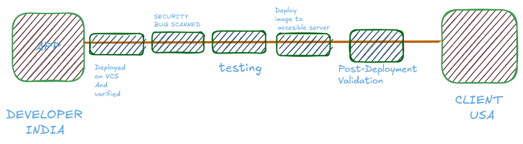

# DEVOPS

## The CI/CD concept



CONTINOUS INTEGRATION                                   CONT. DELIVERY                              CONT. DIPLOYMENT


### CI(CONTINUOUS INTEGRATION)

**Challenges of Isolated Development**

- Extended isolation leads to **difficult merges**, conflicts, and increased **bug accumulation**.
- Bugs are detected **late in the development cycle**, delaying fixes.
- Difficulties in integrating updates **slow down delivery to customers**

### CI is used for :

- **Frequent commits** to a shared repository prevent large, complex merges.
- CI pipelines **automate builds, store artifacts, run unit tests**, and perform **code reviews** .
- The pipeline can be **triggered on every commit or merge**, ensuring **fast feedback loops(webhooks)**.
- Early bug detection improves **code quality and software reliability**.

Successful CI means that once a developer’s changes to an application are merged, those changes are validated by automatically building the application and running different levels of automated testing, typically unit and integration tests, to ensure the changes haven’t broken the app. This means testing everything from classes and function to the different modules that comprise the entire app. One of the benefits of CI is that if automated testing discovers a conflict between new and existing code, it is easier to fix those bugs quickly and often.


# How Most Of Firms Works?


## CD(Continuous DELIVERY/DEPLOYMENT)

This is the next step in the hosting of our developed application or functionality.

### **Continuous Delivery (CD)**

- **Definition**: Continuous Delivery is the practice of automatically packaging and delivering your application (e.g., as a Docker image, `.zip`, `.jar`, etc.) to a **staging or testing environment** after each successful integration (CI).
- **Key Point**: The delivery is **automated**, but the **deployment to production is manual**. This allows teams to push changes frequently and reliably, while still maintaining a final approval step before going live.
- **Example**: Code is built and tested, then deployed to a test server for QA. A release manager can then manually trigger the production deployment.
- **Precondition**: A proper **CI pipeline** must already be in place to ensure every change is tested and validated before being delivered.

### **Continuous Deployment (CD)**

- **Definition**: Continuous Deployment takes things one step further — it **automatically deploys every change that passes tests directly to production**, with **no manual intervention**.
- **What does this mean?** It means every commit that passes automated testing and quality gates is **immediately visible to end users**.
- **Key Requirement**: This process **does not skip testing** — rather, all **testing must be automated and robust enough** to catch any issues before production. If any test fails, the pipeline halts and the change is not deployed.
- **Benefits**:
    - Extremely fast delivery of features.
    - Short feedback loops.
    - High agility for development teams.
- **Risks**:
    - Requires strong automated testing and observability (monitoring, alerting, logging).
    - A bug in production can happen quickly if quality gates are weak.

In essence ,

- **Continuous Delivery** focuses on ensuring that every code change is automatically built, tested, and **prepared for release**. The deployment to production still requires **manual approval** after testing in a staging environment.
- **Continuous Deployment** automates **the entire release pipeline** — from code commit to production deployment — as long as all **automated tests pass**. There's **no manual intervention** between staging and live environments.

## WORKING OF CI/CD


This increases the efficiency of Application!

NOW THIS IS HOW A MULTI-INFRA CI/CD WORKS:


# JENKINS

### —> JOBS:

A Jenkins job encapsulates a specific task or process within the CI/CD pipeline. Whether it's compiling source code, running tests, or deploying applications, Jenkins jobs define and execute these tasks automatically. When configuring a Jenkins job, users encounter a variety of fields, each serving a distinct purpose in defining job behavior and characteristics.

TYPES OF JOBS:


## CREATING A JOB

—>Discard old builds: 

This determines when, if ever, build records for this project should be discarded. Build records include the console output, archived artifacts, and any other metadata related to a particular build.

Keeping fewer builds means less disk space will be used in the *Build Record Root Directory* , which is specified on the *Configure System* screen.

Jenkins offers two options for determining when builds should be discarded:

1. Build age: discard builds when they reach a certain age; for example, seven days old.
2. Build count: discard the oldest build when a certain number of builds already exist.

These two options can be active at the same time, so you can keep builds for 14 days, but only up to a limit of 50 builds, for example. If either limit is exceeded, then any builds beyond that limit will be discarded.

You can also ensure that important builds are kept forever, regardless of the setting here — click the *Keep this build forever* button on the build page.

The last stable and last successful build are also excluded from these rules.

---


In the *Advanced* section, the same options can be specified, but specifically for build **artifacts**. If enabled, build artifacts will be discarded for any builds which exceed the defined limits. The builds themselves will still be kept; only the associated artifacts, if any, will be deleted. For example, if a project builds some software and produces a large installer, which is archived, you may wish to always keep the console log and information about which source control commit was built, while for disk space reasons, you may want to keep only the last three installers that were built.

This can make sense for projects where you can easily recreate the same artifacts later by building the same source control commit again.

---

Note that Jenkins does not discard items immediately when this configuration is updated, or as soon as any of the configured values are exceeded; these rules are evaluated each time a build of this project completes.


-

So here we have something  called AGENTS which are acting as end nodes this means that the jenkins will setup the job and the job is distributed to the agent node.


It is not must to install jenkins to slave nodes we much have java in agents!

## CREATING JENKINS AGENTS:


## GITHUB WEBHOOKS:

Now if we update some thing on our developement build code on github and we want it to automatically updated on the JENKINS Server we can do this by using GiT  WEBHOOKS.


### CREDENTIALS BINDING:

While pushing our image or code to dockerhub or any other repo services we need to hide our credentials in .env variable so that no one can get it. For this same we have a technique called credential binding.

Here am showing dockerhub connection with jenkins using credential binding:

Here we are at this path/


After this click on add credentials:


Now here we have to enter our username and password—> in place of original password we will enter a dummy personal access token from dockerhub .

Go to account settings in docker hub—>


Click on generate new token….


Now use that token as a password!

# KUBERNETES(K8s)

**Kubernetes is a distributed system for declaratively managing containerized applications across clusters of machines with self-healing, autoscaling, load balancing, rolling updates, and infrastructure abstraction.**

### What Kubernetes Does for You:

- Ensures **desired state**: You declare what you want; K8s makes it happen.
- **Self-healing**: Restarts crashed pods, reschedules on failed nodes.
- **Scaling**: Horizontal and vertical pod autoscaling.
- **Rolling Updates / Rollbacks**
- **Load balancing** across services
- **Storage orchestration** (dynamic provisioning)
- **Service discovery** and internal DNS
- **Secret and config management**
- **Multi-tenancy** via namespaces and RBAC

It works on micro-services.

## MONOLITHIC vs MICRO-SERVICES

**In monolithic all the content of a software, an application stays at only a single location.**


Interdependency is very much larger if one of the component fails the software shuts down!

I**n micro-services a big load of application or software is broken down in tiny chunks of services like database, front-end ,back-end and etc…**


IF one of service stops, impact and working is only done on that rest will remain same.

# ARCHITECTURE OF KUBERNETES


**A master node controlling all other worker nodes in a cluster and doing the pre-requisite work assigned.**


- **API SERVER:**  It is the communication gateway between master and worker nodes.
- **Scheduler:** To schedule and run the pods.
- **ETCD**: It is a key value datastore ,it stores everything running in our  k8s.
- **Controller manager:**  Look for everything whether is working fine or not.
- **Kubelet** : Can register node’s to apiserver and check whether everything is running fine or not.
- **service proxy**:  used for accessing the internal pods as a user from outside the node.
- **kubectl**: Kubernetes head which gave instructions of what to.

**CNI** = *Container Network Interface*.

It's a **specification + plugin system** that lets Kubernetes (via Kubelet) configure network interfaces for pods in a modular way.

Kubernetes doesn’t implement networking itself. Instead, it **delegates** pod network setup to CNI **plugins** (Flannel, Calico, Cilium, Weave, etc.).

**TYPES OF CLUSTUR DISTROS**

| Distribution | Type | Features / Notes |
| --- | --- | --- |
| **EKS** | Managed (AWS) | AWS-hosted control plane; integrates with IAM, VPC, ELB |
| **GKE** | Managed (GCP) | Google's flavor; automatic upgrades, auto-repair, Stackdriver |
| **AKS** | Managed (Azure) | Azure flavor; integrates with AAD, Log Analytics |
| **OpenShift** | Self-hosted | Red Hat’s enterprise K8s + security/hardening + developer tools |
| **Rancher** | Self-hosted | Multi-cluster manager + K3s/RKE |
| **K3s** | Lightweight | Super minimal K8s (<100MB binary) for edge/IoT/dev |
| **Minikube** | Local Dev | For local dev/testing. Spins up VM with K8s. |
| **kind** | Local Dev | “Kubernetes IN Docker” — great for CI pipelines |
| **kOps** | Self-hosted | CLI tool to install K8s on AWS |
| **MicroK8s** | Local/Edge | Canonical’s all-in-one binary with snap install |
| **Tanzu** | Enterprise | VMware’s Kubernetes platform |
| **Anthos** | Hybrid | Google’s hybrid cloud platform |

### [**kind**](https://sigs.k8s.io/kind)


**is a tool for running local Kubernetes clusters using Docker container “nodes”.**

**kind was primarily designed for testing Kubernetes itself, but may be used for local development or CI.**

# KIND Cluster Setup Guide

## 1. Installing KIND and kubectl

Install KIND and kubectl using the provided [script](https://github.com/LondheShubham153/kubestarter/blob/main/kind-cluster/install.sh):

## 2. Setting Up the KIND Cluster

Create a kind-config.yaml file:

```yaml

kind: Cluster
apiVersion: kind.x-k8s.io/v1alpha4
nodes:
  - role: control-plane
    image: kindest/node:v1.33.1
  - role: worker
    image: kindest/node:v1.33.1
  - role: worker
    image: kindest/node:v1.33.1

```

Create the cluster using the configuration file:

```bash

kind create cluster --config kind-config.yaml --name tws-kind-cluster

```

Verify the cluster:

```bash

kubectl get nodes
kubectl cluster-info

```

## 3. Accessing the Cluster

Use kubectl to interact with the cluster:

```bash

kubectl cluster-info

```

## 4. Setting Up the Kubernetes Dashboard

Deploy the Dashboard
Apply the Kubernetes Dashboard manifest:

```bash

kubectl apply -f <https://raw.githubusercontent.com/kubernetes/dashboard/v2.7.0/aio/deploy/recommended.yaml>

```

Create an Admin User
Create a dashboard-admin-user.yml file with the following content:

```yaml

apiVersion: v1
kind: ServiceAccount
metadata:
  name: admin-user
  namespace: kubernetes-dashboard
---
apiVersion: rbac.authorization.k8s.io/v1
kind: ClusterRoleBinding
metadata:
  name: admin-user
roleRef:
  apiGroup: rbac.authorization.k8s.io
  kind: ClusterRole
  name: cluster-admin
subjects:
- kind: ServiceAccount
  name: admin-user
  namespace: kubernetes-dashboard

```

Apply the configuration:

```bash

kubectl apply -f dashboard-admin-user.yml

```

Get the Access Token
Retrieve the token for the admin-user:

```bash

kubectl -n kubernetes-dashboard create token admin-user

```

Copy the token for use in the Dashboard login.

Access the Dashboard
Start the Dashboard using kubectl proxy:

```bash

kubectl proxy

```

Open the Dashboard in your browser:

```bash

<http://localhost:8001/api/v1/namespaces/kubernetes-dashboard/services/https:kubernetes-dashboard:/proxy/>

```

Use the token from the previous step to log in.

## 5. Deleting the Cluster

Delete the KIND cluster:

```bash

kind delete cluster --name my-kind-cluster

```

## 6. Notes

Multiple Clusters: KIND supports multiple clusters. Use unique --name for each cluster.
Custom Node Images: Specify Kubernetes versions by updating the image in the configuration file.
Ephemeral Clusters: KIND clusters are temporary and will be lost if Docker is restarted.

### **Kubeadm Installation Guide**

This guide outlines the steps needed to set up a Kubernetes cluster using `kubeadm`.

**Prerequisites**

- Ubuntu OS (Xenial or later)
- `sudo` privileges
- Internet access
- t2.medium instance type or higher

---

**AWS Setup**

1. Ensure that all instances are in the same **Security Group**.
2. Expose port **6443** in the **Security Group** to allow worker nodes to join the cluster.
3. Expose port **22** in the **Security Group** to allows SSH access to manage the instance..

**To do above setup, follow below provided steps**

**Step 1: Identify or Create a Security Group**

1. **Log in to the AWS Management Console**:
    - Go to the **EC2 Dashboard**.
2. **Locate Security Groups**:
    - In the left menu under **Network & Security**, click on **Security Groups**.
3. **Create a New Security Group**:
    - Click on **Create Security Group**.
    - Provide the following details:
        - **Name**: (e.g., `Kubernetes-Cluster-SG`)
        - **Description**: A brief description for the security group (mandatory)
        - **VPC**: Select the appropriate VPC for your instances (default is acceptable)
4. **Add Rules to the Security Group**:
    - **Allow SSH Traffic (Port 22)**:
        - **Type**: SSH
        - **Port Range**: `22`
        - **Source**: `0.0.0.0/0` (Anywhere) or your specific IP
    - **Allow Kubernetes API Traffic (Port 6443)**:
        - **Type**: Custom TCP
        - **Port Range**: `6443`
        - **Source**: `0.0.0.0/0` (Anywhere) or specific IP ranges
5. **Save the Rules**:
    - Click on **Create Security Group** to save the settings.

**Step 2: Select the Security Group While Creating Instances**

- When launching EC2 instances:
    - Under **Configure Security Group**, select the existing security group (`Kubernetes-Cluster-SG`)

> Note: Security group settings can be updated later as needed.
> 

---

**Execute on Both "Master" & "Worker" Nodes**

- **Disable Swap**: Required for Kubernetes to function correctly.
    
    ```
    sudo swapoff -a
    ```
    

**Load Necessary Kernel Modules**: Required for Kubernetes networking.

```
cat <<EOF | sudo tee /etc/modules-load.d/k8s.conf
overlay
br_netfilter
EOF

sudo modprobe overlay
sudo modprobe br_netfilter
```

**Set Sysctl Parameters**: Helps with networking.

```
cat <<EOF | sudo tee /etc/sysctl.d/k8s.conf
net.bridge.bridge-nf-call-iptables  = 1
net.bridge.bridge-nf-call-ip6tables = 1
net.ipv4.ip_forward                 = 1
EOF

sudo sysctl --system
lsmod | grep br_netfilter
lsmod | grep overlay
```

**Install Containerd**:

```
sudo apt-get update
sudo apt-get install -y ca-certificates curl
sudo install -m 0755 -d /etc/apt/keyrings
sudo curl -fsSL https://download.docker.com/linux/ubuntu/gpg -o /etc/apt/keyrings/docker.asc
sudo chmod a+r /etc/apt/keyrings/docker.asc

echo "deb [arch=$(dpkg --print-architecture) signed-by=/etc/apt/keyrings/docker.asc] https://download.docker.com/linux/ubuntu $(. /etc/os-release && echo \"$VERSION_CODENAME\") stable" | sudo tee /etc/apt/sources.list.d/docker.list > /dev/null

sudo apt-get update
sudo apt-get install -y containerd.io

containerd config default | sed -e 's/SystemdCgroup = false/SystemdCgroup = true/' -e 's/sandbox_image = "registry.k8s.io\/pause:3.6"/sandbox_image = "registry.k8s.io\/pause:3.9"/' | sudo tee /etc/containerd/config.toml

sudo systemctl restart containerd
sudo systemctl status containerd
```

**Install Kubernetes Components**:

```
sudo apt-get update
sudo apt-get install -y apt-transport-https ca-certificates curl gpg

curl -fsSL https://pkgs.k8s.io/core:/stable:/v1.29/deb/Release.key | sudo gpg --dearmor -o /etc/apt/keyrings/kubernetes-apt-keyring.gpg

echo 'deb [signed-by=/etc/apt/keyrings/kubernetes-apt-keyring.gpg] https://pkgs.k8s.io/core:/stable:/v1.29/deb/ /' | sudo tee /etc/apt/sources.list.d/kubernetes.list

sudo apt-get update
sudo apt-get install -y kubelet kubeadm kubectl
sudo apt-mark hold kubelet kubeadm kubectl
```

**Execute ONLY on the "Master" Node**

- **Initialize the Cluster**:
    
    ```
    sudo kubeadm init
    ```
    

**Set Up Local kubeconfig**:

```
mkdir -p "$HOME"/.kube
sudo cp -i /etc/kubernetes/admin.conf "$HOME"/.kube/config
sudo chown "$(id -u)":"$(id -g)" "$HOME"/.kube/config
```

**Install a Network Plugin (Calico)**:

```
kubectl apply -f https://raw.githubusercontent.com/projectcalico/calico/v3.26.0/manifests/calico.yaml
```

**Generate Join Command**:

```
kubeadm token create --print-join-command
```

> Copy this generated token for next command.
> 

---

**Execute on ALL of your Worker Nodes**

- Perform pre-flight checks:
    
    ```
    sudo kubeadm reset pre-flight checks
    ```
    

Paste the join command you got from the master node and append `--v=5` at the end:

```
sudo kubeadm join <private-ip-of-control-plane>:6443 --token <token> --discovery-token-ca-cert-hash sha256:<hash> --cri-socket
"unix:///run/containerd/containerd.sock" --v=5
```

**Note**: When pasting the join command from the master node:

1. Add `sudo` at the beginning of the command
2. Add `-v=5` at the end

Example format:

```
sudo <paste-join-command-here> --v=5
```

---

**Verify Cluster Connection**

**On Master Node:**

```
kubectl get nodes

```


---

**Verify Container Status on Worker Node**


# Minikube Installation Guide for Ubuntu

This guide provides step-by-step instructions for installing Minikube on Ubuntu. Minikube allows you to run a single-node Kubernetes cluster locally for development and testing purposes.

## Pre-requisites

- Ubuntu OS
- sudo privileges
- Internet access
- Virtualization support enabled (Check with `egrep -c '(vmx|svm)' /proc/cpuinfo`, 0=disabled 1=enabled)

---

## Step 1: Update System Packages

Update your package lists to make sure you are getting the latest version and dependencies.

```bash
sudo apt update

```

<kbd>

[image](https://github.com/paragpallavsingh/kubernetes-kickstarter/assets/40052830/57f1c5d9-474a-43b8-90b9-fe542e122f3f)

</kbd>

## Step 2: Install Required Packages

Install some basic required packages.

```bash
sudo apt install -y curl wget apt-transport-https

```

<kbd>

[image](https://github.com/paragpallavsingh/kubernetes-kickstarter/assets/40052830/84ad8474-8d4d-4d4b-a04d-def88f76dc9a)

</kbd>

---

## Step 3: Install Docker

Minikube can run a Kubernetes cluster either in a VM or locally via Docker. This guide demonstrates the Docker method.

```bash
sudo apt install -y docker.io

```

<kbd>

[image](https://github.com/paragpallavsingh/kubernetes-kickstarter/assets/40052830/d261f75b-a22f-4510-b3a3-14e1cecaf3e1)

</kbd>

Start and enable Docker.

```bash
sudo systemctl enable --now docker

```

Add current user to docker group (To use docker without root)

```bash
sudo usermod -aG docker $USER && newgrp docker

```

Now, logout (use `exit` command) and connect again.

---

## Step 4: Install Minikube

First, download the Minikube binary using `curl`:

```bash
curl -Lo minikube <https://storage.googleapis.com/minikube/releases/latest/minikube-linux-amd64>

```

Make it executable and move it into your path:

```bash
chmod +x minikube
sudo mv minikube /usr/local/bin/

```

<kbd>

[image](https://github.com/paragpallavsingh/kubernetes-kickstarter/assets/40052830/80e8a137-286a-4334-886b-ea4821f596b2)

</kbd>

---

## Step 5: Install kubectl

Download kubectl, which is a Kubernetes command-line tool.

```bash
curl -LO "<https://dl.k8s.io/release/$>(curl -L -s <https://dl.k8s.io/release/stable.txt>)/bin/linux/amd64/kubectl"

```

**Check above image ⬆️**
Make it executable and move it into your path:

```bash
chmod +x kubectl
sudo mv kubectl /usr/local/bin/

```

<kbd>

[image](https://github.com/paragpallavsingh/kubernetes-kickstarter/assets/40052830/cdda6c84-f6c9-4d05-87e0-ed8627e46a3a)

</kbd>

---

## Step 6: Start Minikube

Now, you can start Minikube with the following command:

```bash
minikube start --driver=docker --vm=true

```

This command will start a single-node Kubernetes cluster inside a Docker container.

---

## Step 7: Check Cluster Status

Check the cluster status with:

```bash
minikube status

```

<kbd>

[image](https://github.com/paragpallavsingh/kubernetes-kickstarter/assets/40052830/a2dabec8-b073-4e1e-a831-dd6845000230)

</kbd>

You can also use `kubectl` to interact with your cluster:

```bash
kubectl get nodes

```

---

## Step 8: Stop Minikube

When you are done, you can stop the Minikube cluster with:

```bash
minikube stop

```

---

## Optional: Delete Minikube Cluster

If you wish to delete the Minikube cluster entirely, you can do so with:

```bash
minikube delete

```

---

That's it! You've successfully installed Minikube on Ubuntu, and you can now start deploying Kubernetes applications for development and testing.

# **NAMESPACE**

**Namespaces in Kubernetes are virtual clusters within a physical cluster. They are used to logically isolate resources, users, and workloads within the same K8s cluster.**


### What Gets Namespaced?

**Namespaced:**

- Pods
- Services
- Deployments, StatefulSets, ReplicaSets
- ConfigMaps, Secrets
- Ingress, NetworkPolicy
- RoleBindings, ResourceQuotas

**NOT Namespaced (cluster-scoped):**

- Nodes
- PersistentVolumes
- ClusterRoles
- StorageClasses
- CustomResourceDefinitions (CRDs)

SOME OF COMMANDS:

```bash
#List all namespaces
kubectl get namespaces
#List all pods in a specific namespace
kubectl get pods -n <namespace>
#Set default namespace for your current context
kubectl config set-context --current --namespace=<namespace>
#Create a new namespace
kubectl create namespace dev
#Use a namespace temporarily for a single command
kubectl get svc -n dev

#for getting all the pods
kubectl get pods -A

#for proper logs of running pods
kubectl create namespace nginx

# getting interactive shell in pod
kubectl exec -it -n nginx nginx -- /bin/bash

```

```bash
#CLUSTER RELATED COMMANDS.
kubectl cluster-info
kubectl version --short
kubectl get nodes
kubectl describe node <node-name>
```

```bash
#POD RELATED COMMANDS
kubectl get pods -A
kubectl get pods -n kube-system
kubectl run nginx --image=nginx
kubectl get pod nginx
kubectl describe pod nginx
kubectl delete pod nginx
```

```bash
#DEPLOYMENT COMMANDS

kubectl create deployment myapp --image=nginx
kubectl expose deployment nginx --port=80 --type=NodePort
kubectl get deployments
kubectl scale deployment myapp --replicas=3
kubectl rollout status deployment myapp
kubectl rollout undo deployment myapp
kubectl delete deployment myapp
```

```bash
#SERVICES

kubectl expose deployment myapp --port=80 --type=NodePort
kubectl get services
kubectl describe service myapp
kubectl delete service myapp
```

```bash
#NAMESPACES

kubectl get ns
kubectl create namespace dev
kubectl run nginx --image=nginx -n dev
kubectl delete ns dev
```

```bash
#RBAC

kubectl create serviceaccount dev-user -n dev
kubectl create role dev-reader --verb=get,list,watch --resource=pods -n dev
kubectl create rolebinding dev-binding --role=dev-reader --serviceaccount=dev:dev-user -n dev

#FOR PROPER LOGS
kubectl logs nginx
kubectl exec -it nginx -- /bin/sh

#TAINTS AND TOLERATIONS

kubectl taint nodes <node-name> key=value:NoSchedule
kubectl describe node <node-name>
kubectl taint nodes <node-name> key:NoSchedule-  # remove taint

#HELM AND INGRESS
curl https://raw.githubusercontent.com/helm/helm/main/scripts/get-helm-3 | bash
helm repo add bitnami https://charts.bitnami.com/bitnami
helm repo update    #{HELM INIT}

#INGRESS CONTROL

kubectl apply -f https://raw.githubusercontent.com/kubernetes/ingress-nginx/controller-v1.10.0/deploy/static/provider/kind/deploy.yaml

kubectl get pods -n ingress-nginx

#DEBUGGING

kubectl describe pod <pod>
kubectl get events --sort-by=.metadata.creationTimestamp
kubectl top nodes
kubectl top pods
kubectl get componentstatuses

#CLEANUP
kind delete cluster --name kind-cluster

```

```bash
#port forwarding in pods temporary

kubectl run nginx --image=nginx --port=80
kubectl expose pod nginx --type=ClusterIP --port=80
kubectl port-forward svc/nginx 8080:80
```

# **Deployment**

A **Deployment** in Kubernetes is a controller object that manages a set of **replica Pods**. It ensures that a **desired number of identical Pods** (usually running a containerized application) are **running and healthy** at all times.

### What Does a Deployment Do?

1. **Creates Pods Automatically**:
    
    You define a deployment, and Kubernetes creates the Pods for you.
    
2. **Self-Heals**:
    
    If a Pod dies or node crashes, Deployment recreates it.
    
3. **Manages Roll-outs** :
    
    Supports **zero-downtime** updates to the app by rolling out new Pods and phasing out old ones.
    
4. **Rollbacks**:
    
    You can **undo** a rollout and go back to the previous stable version.
    
5. **Scalability**:
    
    Easily increase/decrease the number of Pod replicas.
    

### Replica-Set (RS)

**What it is**:

A low-level controller that ensures a specified number of **identical Pods** are running at all times.

**Key Features**:

- Keeps N number of Pods alive.
- Does not support rolling updates.
- Usually **not used directly** — managed through `Deployment`.

```yaml
apiVersion: apps/v1
kind: ReplicaSet
metadata:
name: nginx-replicaset
spec:
replicas: 2
selector:
matchLabels:
app: nginx-rs
template:
metadata:
labels:
app: nginx-rs
spec:
containers:
- name: nginx
image: nginx:latest
ports:
- containerPort: 80
#just no rolling update! as same as deployment...
```


### Deployment

**What it is**:

A **high-level abstraction** that manages Replica-Sets and supports features like **rolling updates**, **rollbacks**, and **scaling**.

**Key Features**:

- Manages Replica-Sets under the hood.
- Supports rolling updates and rollbacks.
- Declarative update strategy.
- Stateless only.


```yaml
apiVersion: apps/v1
kind: Deployment
metadata:
name: nginx-deployment
namespace: nginx
spec:
replicas: 3
selector:
matchLabels:
app: nginx
template:
metadata:
labels:
app: nginx
spec:
containers:
- name: nginx
image: nginx:latest
ports:
- containerPort: 80
```

### Stateful-Set

**What it is**:

Manages the deployment and scaling of **stateful** applications like databases.

**Key Features**:

- Each Pod has a **unique identity** (`pod-0`, `pod-1`, etc.).
- Persistent volumes are **stable and sticky**.
- Maintains **ordering and uniqueness**.
- Slow rollout: Pods come up one-by-one in order.

## **Daemon sets**

A **DaemonSet** ensures that **a copy of a Pod runs on every (or selected) Node** in the cluster.

[https://www.notion.so](https://www.notion.so)

```yaml
apiVersion: apps/v1
kind: DaemonSet
metadata:
name: nginx-daemonset
namespace: kube-system
spec:
selector:
matchLabels:
app: nginx-ds
template:
metadata:
labels:
app: nginx-ds
spec:
containers:
- name: nginx
image: nginx:latest
ports:
- containerPort: 80
```

# JOBS

**A Job** is used to run **one-time** or **batch** tasks—unlike Deployments, which manage long-running Pods.

A **Job** ensures that **a specified number of Pods successfully terminate** (complete). It is used for **short-lived** workloads such as:

- Data processing
- Database migrations
- Backup tasks
- Scheduled reporting

Once the Job completes successfully, it won’t restart the Pods.

### Types of Jobs

1. **Simple Job**
    - Runs a Pod to completion (1 or more times).
    - Example: run a script or command once.
2. **Parallel Jobs**
    - **With a fixed completion count**
        - Runs `n` Pods in parallel and finishes when all `n` succeed.
    - **With a work queue**
        - Pods pull tasks from a queue (like RabbitMQ).
3. **CronJob**
    - Like a Unix cron: runs Jobs on a schedule (e.g., daily backups)
    
    A **CronJob** in Kubernetes is like a Unix `cron` — it runs **Jobs on a scheduled basis**.
    
    Use it when you want to run tasks **periodically** (e.g., backups, report generation, cleanups).
    
    ### Use Cases
    
    - Daily DB backups
    - Monthly report generation
    - Cleanup temporary files
    - Send scheduled emails
    - Ping health checks regularly

# **KUBE-PROXY**


# VOLUMES


# INGRESS:


## **INSTALLATION:**

### Ingress NGINX

---

`kubectl apply -f https://kind.sigs.k8s.io/examples/ingress/deploy-ingress-nginx.yaml`

Now ingress is create.

IF WE WANT TO ACCESS SOME APP ON /app AND ANOTHER ON /nginx WE HAVE TO CONFIGURE THIS INGRESS.

```yaml
kind: Pod
apiVersion: v1
metadata:
  name: foo-app
  labels:
    app: foo
spec:
  containers:
  - command:
    - /agnhost
    - serve-hostname
    - --http=true
    - --port=8080
    image: registry.k8s.io/e2e-test-images/agnhost:2.39
    name: foo-app
---
kind: Service
apiVersion: v1
metadata:
  name: foo-service
spec:
  selector:
    app: foo
  ports:
  # Default port used by the image
  - port: 8080
---
kind: Pod
apiVersion: v1
metadata:
  name: bar-app
  labels:
    app: bar
spec:
  containers:
  - command:
    - /agnhost
    - serve-hostname
    - --http=true
    - --port=8080
    image: registry.k8s.io/e2e-test-images/agnhost:2.39
    name: bar-app
---
kind: Service
apiVersion: v1
metadata:
  name: bar-service
spec:
  selector:
    app: bar
  ports:
  # Default port used by the image
  - port: 8080
---
apiVersion: networking.k8s.io/v1
kind: Ingress
metadata:
  name: example-ingress
spec:
  rules:
  - http:
      paths:
      - pathType: Prefix
        path: /foo
        backend:
          service:
            name: foo-service
            port:
              number: 8080
      - pathType: Prefix
        path: /bar
        backend:
          service:
            name: bar-service
            port:
              number: 8080
---
```

---

Now just do:

```bash
kubectl -n ingress-nginx get services
NAME                                 TYPE           CLUSTER-IP     EXTERNAL-IP   PORT(S)                      AGE
ingress-nginx-controller             LoadBalancer   10.96.33.233   192.168.8.5   80:31753/TCP,443:30288/TCP   27d
ingress-nginx-controller-admission   ClusterIP      10.96.80.178   <none>        443/TCP                      27d
```

JUST FORWARD THE PORT OF ingress-nginx-controller TO PUBLIC IP OR USE IT LOCALLY BY LOCALHOST/foo.

and its done!!!

- [ ]  LEARN ABOUT ANNOTATIONS.

# Stateful-SETS

A StatefulSet runs a group of Pods, and maintains a sticky identity for each of those Pods. This is useful for managing applications that need persistent storage or a stable, unique network identity.

### What Are **StatefulSets** in Kubernetes?

A **StatefulSet** is a Kubernetes resource used to manage **stateful applications** — those that require:

- **Persistent storage** (each pod keeps its own disk)
- **Stable network identities** (pod names/IPs shouldn't change)
- **Ordered startup/shutdown/rolling updates**

## When to Use a StatefulSet?

Use it for apps that need:

- Persistent data (e.g. **MySQL**, **PostgreSQL**, **Kafka**, **MongoDB**, **Redis** in HA mode)
- Unique identity per replica
- Ordered operations

---

**HEADLESS SERVICE: A service which is not associated with any of CLusterIp. that mean clusterIp is setted to none.**

Example:

```yaml
apiVersion: apps/v1
kind: StatefulSet
metadata:
name: demo-app
spec:
serviceName: demo-app  # Must match the headless service name
replicas: 3
selector:
matchLabels:
app: demo
template:
metadata:
labels:
app: demo
spec:
containers:
- name: demo
image: busybox
command: ["sh", "-c", "while true; do echo $(hostname) >> /data/out.txt; sleep 5; done"]
volumeMounts:
- name: data
mountPath: /data
volumeClaimTemplates:
metadata:
name: data
spec:
accessModes: ["ReadWriteOnce"]
resources:
requests:
storage: 100Mi
```

```yaml
apiVersion: v1
kind: Service
metadata:
  name: demo-app
spec:
  clusterIP: None  # Headless!
  selector:
    app: demo
  ports:
    - port: 80
      name: http

```

# SCALING && SCHEDULING—>

### —> RESOURCE QUOTA and LIMITS

It is the configurations which decides the limit of resources a particular  component can take,  a **ResourceQuota** is used to **limit the resource consumption** (like CPU, memory, pods, storage, etc.) **per namespace**. 

# Probes:

Probes are how Kubernetes checks the **health and readiness** of containers:

| Probe Type | Purpose |
| --- | --- |
| **livenessProbe** | Is the app still running? If not, restart it. |
| **readinessProbe** | Is the app ready to receive traffic? If not, remove from Service endpoints. |
| **startupProbe** | Wait longer for slow-starting apps before applying livenessProbe. |
|  |  |

```yaml
kind: Deployment
apiVersion: apps/v1
metadata:
  name: nginx-deployment
  labels:
    app: nginx
  namespace: nginx2
  

spec:
  replicas: 1
  selector:
    matchLabels:
      app: nginx
  template:
    metadata:
   
      labels:
        app: nginx
    spec:
      containers:
        - name: nginx
          image: nginx:latest
          ports:
            - containerPort: 80
          resources:
            requests:
              cpu: 100m
              memory: 128Mi

            limits:
              cpu: 200m
              memory: 256Mi

          livenessProbe:
            httpGet:
              path: /
              port: 80
            initialDelaySeconds: 10
            periodSeconds: 5
          readinessProbe:
            httpGet:
              path: /
              port: 80
            initialDelaySeconds: 5
            periodSeconds: 5
          startupProbe:
            httpGet:
              path: /
              port: 80
            failureThreshold: 30
            periodSeconds: 5
## service

kind: Service
apiVersion: v1
metadata:
  name: nginx-service
  namespace: nginx2
spec:
  selector:
    app: nginx
  type: ClusterIP
  ports:
    - protocol: TCP
      port: 80
      targetPort: 80

```

# Taints & Toleration :

## What is a Taint?

> “Taint” = mark a node as unwelcoming to pods
> 

When you **taint a node**, it means:

- Only pods with matching **tolerations** are allowed to be scheduled on it.

Scheduling PODS USING Different  options:

```bash
## PreferNoSchedule--> Kubernetes tries to avoid, but may still schedule pods there.

admin@ip-172-31-13-117:~/k8s/practice$ kubectl taint nodes sahil-kind-cluster-worker2 worker=true:PreferNoSchedule
node/sahil-kind-cluster-worker2 tainted
admin@ip-172-31-13-117:~/k8s/practice$ kubectl apply -f namespace.yml 
namespace/nginx2 created
admin@ip-172-31-13-117:~/k8s/practice$ kubectl apply -f deployment.yaml 
deployment.apps/nginx-deployment created
admin@ip-172-31-13-117:~/k8s/practice$ kubectl apply -fs
error: the path "s" does not exist
admin@ip-172-31-13-117:~/k8s/practice$ kubectl apply -f service.yml 
service/nginx-service created
admin@ip-172-31-13-117:~/k8s/practice$ kubectl get pod -n nginx2
NAME                                READY   STATUS    RESTARTS   AGE
nginx-deployment-77c769c5b5-zxnpc   1/1     Running   0          16s
admin@ip-172-31-13-117:~/k8s/practice$ kubectl get pod -n nginx2
NAME                                READY   STATUS    RESTARTS   AGE
nginx-deployment-77c769c5b5-zxnpc   1/1     Running   0          32s
admin@ip-172-31-13-117:~/k8s/practice$ kubectl get deployment -n nginx2
NAME               READY   UP-TO-DATE   AVAILABLE   AGE
nginx-deployment   1/1     1            1           43s
admin@ip-172-31-13-117:~/k8s/practice$ kubectl describe pod/nginx-deployment-77c769c5b5-zxnpc -n nginx2
Name:             nginx-deployment-77c769c5b5-zxnpc
Namespace:        nginx2
Priority:         0
Service Account:  default
Node:             sahil-kind-cluster-worker2/172.18.0.2
Start Time:       Wed, 23 Jul 2025 15:30:46 +0000
Labels:           app=nginx
                  pod-template-hash=77c769c5b5
Annotations:      <none>
Status:           Running
IP:               10.244.2.3
IPs:
  IP:           10.244.2.3
Controlled By:  ReplicaSet/nginx-deployment-77c769c5b5
Containers:
  nginx:
    Container ID:   containerd://806146763ca5e2f58ae33f411477c9e279bcaf15e386f410bee0a2e443866d5a
    Image:          nginx:latest
    Image ID:       docker.io/library/nginx@sha256:84ec966e61a8c7846f509da7eb081c55c1d56817448728924a87ab32f12a72fb
    Port:           80/TCP
    Host Port:      0/TCP
    State:          Running
      Started:      Wed, 23 Jul 2025 15:30:48 +0000
    Ready:          True
    Restart Count:  0
    Limits:
      cpu:     200m
      memory:  256Mi
    Requests:
      cpu:        100m
      memory:     128Mi
    Liveness:     http-get http://:80/ delay=10s timeout=1s period=5s #success=1 #failure=3
    Readiness:    http-get http://:80/ delay=5s timeout=1s period=5s #success=1 #failure=3
    Startup:      http-get http://:80/ delay=0s timeout=1s period=5s #success=1 #failure=30
    Environment:  <none>
    Mounts:
      /var/run/secrets/kubernetes.io/serviceaccount from kube-api-access-q2z8h (ro)
Conditions:
  Type                        Status
  PodReadyToStartContainers   True 
  Initialized                 True 
  Ready                       True 
  ContainersReady             True 
  PodScheduled                True 
Volumes:
  kube-api-access-q2z8h:
    Type:                    Projected (a volume that contains injected data from multiple sources)
    TokenExpirationSeconds:  3607
    ConfigMapName:           kube-root-ca.crt
    Optional:                false
    DownwardAPI:             true
QoS Class:                   Burstable
Node-Selectors:              <none>
Tolerations:                 node.kubernetes.io/not-ready:NoExecute op=Exists for 300s
                             node.kubernetes.io/unreachable:NoExecute op=Exists for 300s
Events:
  Type    Reason     Age   From               Message
  ----    ------     ----  ----               -------
  Normal  Scheduled  62s   default-scheduler  Successfully assigned nginx2/nginx-deployment-77c769c5b5-zxnpc to sahil-kind-cluster-worker2
  Normal  Pulling    61s   kubelet            Pulling image "nginx:latest"
  Normal  Pulled     61s   kubelet            Successfully pulled image "nginx:latest" in 911ms (911ms including waiting). Image size: 72223946 bytes.
  Normal  Created    60s   kubelet            Created container: nginx
  Normal  Started    60s   kubelet            Started container nginx

##Noschedule--> IT will never schedule on that node.
admin@ip-172-31-13-117:~/k8s/practice$ kubectl   taint node sahil-kind-cluster-worker2 worker=true:NoSchedule
node/sahil-kind-cluster-worker2 tainted
admin@ip-172-31-13-117:~/k8s/practice$ kubectl   taint node sahil-kind-cluster-worker worker=true:NoSchedule
node/sahil-kind-cluster-worker tainted
admin@ip-172-31-13-117:~/k8s/practice$ kubectl delete -f namespace.yml 
namespace "nginx2" deleted
admin@ip-172-31-13-117:~/k8s/practice$ kubectl apply -f namespace.yml 
namespace/nginx2 created
admin@ip-172-31-13-117:~/k8s/practice$ kubectl apply -f deployment.yaml 
deployment.apps/nginx-deployment created
admin@ip-172-31-13-117:~/k8s/practice$ kubectl apply -f service.yml 
service/nginx-service created
admin@ip-172-31-13-117:~/k8s/practice$ kubectl get pod -n nginx2
NAME                                READY   STATUS    RESTARTS   AGE
nginx-deployment-77c769c5b5-lb887   0/1     Pending   0          11s
admin@ip-172-31-13-117:~/k8s/practice$ kubectl describe pod/nginx-deployment-77c769c5b5-lb887 -n nginx2 
Name:             nginx-deployment-77c769c5b5-lb887
Namespace:        nginx2
Priority:         0
Service Account:  default
Node:             <none>
Labels:           app=nginx
                  pod-template-hash=77c769c5b5
Annotations:      <none>
Status:           Pending
IP:               
IPs:              <none>
Controlled By:    ReplicaSet/nginx-deployment-77c769c5b5
Containers:
  nginx:
    Image:      nginx:latest
    Port:       80/TCP
    Host Port:  0/TCP
    Limits:
      cpu:     200m
      memory:  256Mi
    Requests:
      cpu:        100m
      memory:     128Mi
    Liveness:     http-get http://:80/ delay=10s timeout=1s period=5s #success=1 #failure=3
    Readiness:    http-get http://:80/ delay=5s timeout=1s period=5s #success=1 #failure=3
    Startup:      http-get http://:80/ delay=0s timeout=1s period=5s #success=1 #failure=30
    Environment:  <none>
    Mounts:
      /var/run/secrets/kubernetes.io/serviceaccount from kube-api-access-g8ppr (ro)
Conditions:
  Type           Status
  PodScheduled   False 
Volumes:
  kube-api-access-g8ppr:
    Type:                    Projected (a volume that contains injected data from multiple sources)
    TokenExpirationSeconds:  3607
    ConfigMapName:           kube-root-ca.crt
    Optional:                false
    DownwardAPI:             true
QoS Class:                   Burstable
Node-Selectors:              <none>
Tolerations:                 node.kubernetes.io/not-ready:NoExecute op=Exists for 300s
                             node.kubernetes.io/unreachable:NoExecute op=Exists for 300s
Events:
  Type     Reason            Age   From               Message
  ----     ------            ----  ----               -------
  Warning  FailedScheduling  36s   default-scheduler  0/3 nodes are available: 1 node(s) had untolerated taint {node-role.kubernetes.io/control-plane: }, 2 node(s) had untolerated taint {worker: true}. preemption: 0/3 nodes are available: 3 Preemption is not helpful for scheduling.

##NoExecute--> Also evicts already-running pods unless tolerated.
```

tolerations:

```yaml
apiVersion: apps/v1
kind: Deployment
metadata:
  name: nginx-deployment
  namespace: nginx2
  labels:
    app: nginx

spec:
  replicas: 1
  selector:
    matchLabels:
      app: nginx

  template:
    metadata:
      labels:
        app: nginx
    spec:
      containers:
        - name: nginx
          image: nginx:latest
          ports:
            - containerPort: 80
          resources:
            requests:
              cpu: 100m
              memory: 128Mi
            limits:
              cpu: 200m
              memory: 256Mi
          livenessProbe:
            httpGet:
              path: /
              port: 80
            initialDelaySeconds: 10
            periodSeconds: 5
          readinessProbe:
            httpGet:
              path: /
              port: 80
            initialDelaySeconds: 5
            periodSeconds: 5
          startupProbe:
            httpGet:
              path: /
              port: 80
            failureThreshold: 30
            periodSeconds: 5
      tolerations:
        - key: "worker"
          operator: "Equal"
          value: "true"
          effect: "NoSchedule"

```

# HPA(HORIZONTAL POD AUTO-SCALING)

### HPA automatically scales the **number of pod replicas** based on CPU/memory usage or custom metrics.

**HPA** is a Kubernetes **controller** that **automatically scales the number of Pods** in a Deployment, StatefulSet, or ReplicaSet **based on observed metrics**, like CPU or memory usage.

- **Horizontal scaling** = Adding or removing Pods
- **Vertical scaling** = Giving more CPU/Memory to a Pod (not what HPA does)

For generating load to test Pod auto scaling:

```yaml
while true; do :; done

kubectl exec -n ngnix -it pod/nginx-deployment-65dc445649-xmz4h -- bash
apt update && apt install -y stress
stress --cpu 1 --timeout 600

while true; do wget -q -O- http://nginx-service.ngnix.svc.cluster.local > /dev/null; done

```

VPA

NODE AFFINTIY

# USER MANAGEMENT

### **RBAC( ROLE BASED ACCESS CONTROL)**


ROLE:

An RBAC *Role* or *ClusterRole* contains rules that represent a set of permissions. Permissions are purely additive (there are no "deny" rules).

A Role always sets permissions within a particular [namespace](https://kubernetes.io/docs/concepts/overview/working-with-objects/namespaces); when you create a Role, you have to specify the namespace it belongs in.

CLUSTER ROLE :

ClusterRole, by contrast, is a non-namespaced resource. The resources have different names (Role and ClusterRole) because a Kubernetes object always has to be either namespaced or not namespaced; it can't be both.

ClusterRoles have several uses. You can use a ClusterRole to:

1. define permissions on namespaced resources and be granted access within individual namespace(s)
2. define permissions on namespaced resources and be granted access across all namespaces
3. define permissions on cluster-scoped resources

An Example of read only pod in default namespace :

```yaml
apiVersion: [rbac.authorization.k8s.io/v1](http://rbac.authorization.k8s.io/v1)
kind: Role
metadata:
namespace: default
name: pod-reader
rules:
apiGroups: [""] # "" indicates the core API group
resources: ["pods"]
verbs: ["get", "watch", "list"]
```

A cluster role example giving read only access to some secrets:

```yaml
apiVersion: rbac.authorization.k8s.io/v1
kind: ClusterRole
metadata:
  # "namespace" omitted since ClusterRoles are not namespaced
  name: secret-reader
rules:
- apiGroups: [""]
  #
  # at the HTTP level, the name of the resource for accessing Secret
  # objects is "secrets"
  resources: ["secrets"]
  verbs: ["get", "watch", "list"]

```

### **RoleBinding and ClusterRoleBinding [](https://kubernetes.io/docs/reference/access-authn-authz/rbac/#rolebinding-and-clusterrolebinding)**

**RoleBinding :** A role binding grants the permissions defined in a role to a user or set of users. It holds a list of *subjects* (users, groups, or service accounts), and a reference to the role being granted. A RoleBinding grants permissions within a specific namespace whereas a ClusterRoleBinding grants that access cluster-wide.A RoleBinding may reference any Role in the same namespace. Alternatively, a RoleBinding can reference a ClusterRole and bind that ClusterRole to the namespace of the RoleBinding. If you want to bind a ClusterRole to all the namespaces in your cluster, you use a ClusterRoleBinding.

role binding:

```yaml

apiVersion: rbac.authorization.k8s.io/v1
# This role binding allows "jane" to read pods in the "default" namespace.
# You need to already have a Role named "pod-reader" in that namespace.
kind: RoleBinding
metadata:
  name: read-pods
  namespace: default
subjects:
# You can specify more than one "subject"
- kind: User
  name: jane # "name" is case sensitive
  apiGroup: rbac.authorization.k8s.io
roleRef:
  # "roleRef" specifies the binding to a Role / ClusterRole
  kind: Role #this must be Role or ClusterRole
  name: pod-reader # this must match the name of the Role or ClusterRole you wish to bind to
  apiGroup: rbac.authorization.k8s.io

```

A RoleBinding can also reference a ClusterRole to grant the permissions defined in that ClusterRole to resources inside the RoleBinding's namespace. This kind of reference lets you define a set of common roles across your cluster, then reuse them within multiple namespaces.

ClusterRoleBinding for one namespace:

```yaml
apiVersion: rbac.authorization.k8s.io/v1
# This role binding allows "dave" to read secrets in the "development" namespace.
# You need to already have a ClusterRole named "secret-reader".
kind: RoleBinding
metadata:
  name: read-secrets
  #
  # The namespace of the RoleBinding determines where the permissions are granted.
  # This only grants permissions within the "development" namespace.
  namespace: development
subjects:
- kind: User
  name: dave # Name is case sensitive
  apiGroup: rbac.authorization.k8s.io
roleRef:
  kind: ClusterRole
  name: secret-reader
  apiGroup: rbac.authorization.k8s.io

```

ClusterRoleBinding  for global:

```yaml
apiVersion: rbac.authorization.k8s.io/v1
# This cluster role binding allows anyone in the "manager" group to read secrets in any namespace.
kind: ClusterRoleBinding
metadata:
  name: read-secrets-global
subjects:
- kind: Group
  name: manager # Name is case sensitive
  apiGroup: rbac.authorization.k8s.io
roleRef:
  kind: ClusterRole
  name: secret-reader
  apiGroup: rbac.authorization.k8s.io

```

**After you create a binding, you cannot change the Role or ClusterRole that it refers to. If you try to change a binding's `roleRef`, you get a validation error. If you do want to change the `roleRef` for a binding, you need to remove the binding object and create a replacement.**

The `kubectl auth reconcile` command-line utility creates or updates a manifest file containing RBAC objects, and handles deleting and recreating binding objects if required to change the role they refer to. See [command usage and examples](https://kubernetes.io/docs/reference/access-authn-authz/rbac/#kubectl-auth-reconcile) for more information.

# Monitoring and logging

---

# 📘 Monitoring and Logging in Kubernetes

---

## 🔹 1. INTRODUCTION

### ➤ Why Monitoring and Logging Matter

Kubernetes is a dynamic, distributed system. Understanding what's happening inside it—both **in real-time** and **historically**—is essential for:

- Debugging issues (e.g., crashes, performance bottlenecks)
- Ensuring reliability, uptime, and performance
- Capacity planning and autoscaling
- Security auditing and compliance

---

## 🔹 2. MONITORING IN KUBERNETES

### ✅ What is Monitoring?

Monitoring is the **continuous collection of system metrics** (like CPU, memory, I/O) and **Kubernetes object states** (e.g., pod status, number of replicas).

---

### 📊 Common Metrics in K8s

| Metric Type | Example |
| --- | --- |
| Resource usage | CPU, memory, disk, network |
| Application metrics | Request rate, latency, errors |
| Cluster metrics | Node health, pod count/status |
| API server metrics | Request rate, error codes |

---

### 🔧 Monitoring Components

### 1. **Prometheus**

- Most popular open-source monitoring tool
- Pulls metrics via HTTP `/metrics` endpoint (Prometheus exposition format)
- Stores time-series data
- Uses **PromQL** query language

### 2. **Grafana**

- Dashboard & visualization tool
- Pulls data from Prometheus, Loki, etc.
- Custom, real-time dashboards for metrics

### 3. **kube-state-metrics**

- Exposes Kubernetes object states as metrics (e.g., replica counts, pod phases)
- Read-only agent

### 4. **Metrics Server**

- Lightweight source for real-time metrics
- Used by **Horizontal Pod Autoscaler (HPA)**
- Commands:
    
    ```bash
    kubectl top pods
    kubectl top nodes
    
    ```
    

### 5. **Node Exporter**

- Exposes OS and hardware metrics of nodes

### 6. **Thanos / Cortex**

- Scalable long-term storage layer for Prometheus data
- Multi-cluster, highly available

---

### 📌 Use Case Example

**Horizontal Pod Autoscaler (HPA)**:

- Uses metrics from Metrics Server to autoscale pods:

```yaml
apiVersion: autoscaling/v2
kind: HorizontalPodAutoscaler
spec:
  metrics:
    - type: Resource
      resource:
        name: cpu
        target:
          type: Utilization
          averageUtilization: 60

```

---

### 🧰 Example Monitoring Stack

```
[Node Exporter]     [Kube-state-metrics]
       ↓                   ↓
    [Prometheus] ←────────┘
         ↓
     [Grafana]

```

---

## 🔹 3. LOGGING IN KUBERNETES

### ✅ What is Logging?

Logging is about capturing **application output, system events, and cluster activities** over time. It helps debug specific incidents.

---

### 🧱 Logging Architecture in Kubernetes

### 📂 Step-by-step:

1. Applications log to **stdout/stderr**
2. **Container runtime** (e.g., containerd) writes logs to files (`/var/log/containers`)
3. **Kubelet** manages log file rotation
4. **Log agents** (like Fluentd or Fluent Bit) **collect** logs from host filesystem
5. Logs are sent to a **centralized backend** (Elasticsearch, Loki, etc.)
6. Tools like **Kibana or Grafana** visualize/search logs

---

### 🔧 Popular Logging Tools

### 1. **Fluentd / Fluent Bit**

- Log forwarders
- Lightweight and extensible (can filter, parse, enrich logs)
- Fluent Bit is a high-performance alternative to Fluentd

### 2. **Elasticsearch**

- Searchable log storage engine
- Scales horizontally

### 3. **Kibana**

- Visualization tool for logs in Elasticsearch
- Offers filtering, dashboards, timelines

### 4. **Loki**

- Log aggregation tool built by Grafana Labs
- Works like Prometheus but for logs
- Uses labels instead of full indexing (more efficient)

---

### 🧰 Example Logging Stack (EFK)

```
[Application Logs]
      ↓
[Fluentd / Fluent Bit]
      ↓
[Elasticsearch]
      ↓
[Kibana]

```

---

## 🔹 4. AUDIT LOGGING IN KUBERNETES

### 📌 What It Is

Audit logging records **every request** to the Kubernetes API server:

- What user did what?
- On which resource?
- When?

### 🛠️ Enabling Audit Logs:

Pass these flags to `kube-apiserver`:

```bash
--audit-policy-file=/etc/kubernetes/audit-policy.yaml
--audit-log-path=/var/log/k8s_audit.log

```

### 🧾 Sample Policy:

```yaml
apiVersion: audit.k8s.io/v1
kind: Policy
rules:
- level: RequestResponse
  resources:
    - group: ""
      resources: ["pods", "secrets"]

```

---

## 🔹 5. DIFFERENCE BETWEEN MONITORING & LOGGING

| Feature | Monitoring | Logging |
| --- | --- | --- |
| Purpose | Track metrics and performance | Debug issues through detailed logs |
| Format | Time-series data | Plain text or structured log lines |
| Storage | Prometheus TSDB | Elasticsearch, Loki, files |
| Tools | Prometheus, Grafana, Thanos | Fluentd, Elasticsearch, Kibana, Loki |
| Granularity | Aggregated metrics | Per-event/per-line |
| Use Cases | Autoscaling, alerting, capacity | Debugging, root cause analysis |

---

## 🔹 6. ALERTING

### 🔔 Alertmanager

- Works with Prometheus to send alerts
- Supports routing alerts to:
    - Email
    - Slack
    - PagerDuty
    - Webhooks

### 🔧 Example Alert Rule (Prometheus)

```yaml
groups:
- name: pod_alerts
  rules:
  - alert: HighCPUUsage
    expr: rate(container_cpu_usage_seconds_total[1m]) > 0.8
    for: 2m
    labels:
      severity: warning
    annotations:
      summary: "Pod CPU usage is high"

```

---

## 🔹 7. BEST PRACTICES

### ✅ Monitoring

- Define clear SLIs (Service Level Indicators) and SLOs
- Use dashboards per microservice
- Enable alerts for real incidents only (avoid alert fatigue)

### ✅ Logging

- Use structured logs (JSON preferred)
- Redact secrets and PII
- Set log rotation & retention policies
- Use labels (e.g., `app`, `pod`, `namespace`) in logs

---

## 🔹 8. ADVANCED OBSERVABILITY (Optional Topics)

| Concept | Description |
| --- | --- |
| Distributed Tracing | Tracks requests across services (e.g., Jaeger, OpenTelemetry) |
| OpenTelemetry | Unified observability framework (metrics + logs + traces) |
| Service Mesh | Tools like Istio provide automatic metrics/logging/tracing |
| Sidecar Logging | Dedicated log processors in sidecar container |

## **Dashboard**

## Setting Up the Kubernetes Dashboard

Deploy the Dashboard
Apply the Kubernetes Dashboard manifest:

```bash
kubectl apply -f https://raw.githubusercontent.com/kubernetes/dashboard/v2.7.0/aio/deploy/recommended.yaml
```

Create an Admin User
Create a dashboard-admin-user.yml file with the following content:

```yaml
apiVersion: v1
kind: ServiceAccount
metadata:
  name: admin-user
  namespace: kubernetes-dashboard
---
apiVersion: rbac.authorization.k8s.io/v1
kind: ClusterRoleBinding
metadata:
  name: admin-user
roleRef:
  apiGroup: rbac.authorization.k8s.io
  kind: ClusterRole
  name: cluster-admin
subjects:
- kind: ServiceAccount
  name: admin-user
  namespace: kubernetes-dashboard
```

Apply the configuration:

```
kubectl apply -f dashboard-admin-user.yml
```

Get the Access Token
Retrieve the token for the admin-user:

```
kubectl -n kubernetes-dashboard create token admin-user
```

Copy the token for use in the Dashboard login.

Access the Dashboard
Start the Dashboard using kubectl proxy:

```
kubectl proxy
```

Open the Dashboard in your browser:

```
http://localhost:8001/api/v1/namespaces/kubernetes-dashboard/services/https:kubernetes-dashboard:/proxy/
```

Use the token from the previous step to log in.

**Custom resource definitions and operators —→ ## LEARN TO CREATE**

# HELM - KUBERNETES PACKAGE MANAGER

---

## 1. What is Helm?

- Helm is a **package manager** for Kubernetes.
- It helps **define**, **install**, and **upgrade** Kubernetes applications.
- Helm packages are called **Charts**.

---

## 2. Why Use Helm?

- Simplifies Kubernetes app deployment.
- Manages complex apps with reusable templates.
- Version control and rollback support.
- Parameterize configurations using `values.yaml`.

---

## 3. Key Concepts

### Chart

- A Helm package.
- Contains:
    - `Chart.yaml` — metadata about the chart.
    - `values.yaml` — default configuration values.
    - `templates/` — YAML templates to generate Kubernetes manifests.
    - Optional: `charts/` (dependencies), `LICENSE`, `README.md`

### Release

- A running instance of a Helm chart in a Kubernetes cluster.

### Repository

- A place where charts are stored and shared (like DockerHub for Helm).
- Example: ArtifactHub, Bitnami repo.

---

## 4. Helm Architecture

- **Client**: Helm CLI tool.
- **Server (Deprecated)**: Tiller (used in Helm v2, removed in Helm v3).
- Helm v3 communicates directly with Kubernetes API server.

---

## 5. Installing Helm (Linux)

```bash
curl https://raw.githubusercontent.com/helm/helm/main/scripts/get-helm-3 | bash

```

Verify:

```bash
helm version

```

---

## 6. Helm Commands

### Install a Chart

```bash
helm install <release-name> <chart-name> --values my-values.yaml

```

Example:

```bash
helm install my-nginx bitnami/nginx

```

### Uninstall a Release

```bash
helm uninstall <release-name>

```

### Upgrade a Release

```bash
helm upgrade <release-name> <chart-name> --values updated-values.yaml

```

### Rollback a Release

```bash
helm rollback <release-name> <revision-number>

```

### View Releases

```bash
helm list

```

### Dry Run (Preview)

```bash
helm install --dry-run --debug <release-name> <chart-name>

```

---

## 7. Chart Directory Structure

```
mychart/
├── Chart.yaml
├── values.yaml
├── templates/
│   ├── deployment.yaml
│   ├── service.yaml
│   └── _helpers.tpl

```

---

## 8. Helm Template Syntax

- Helm uses **Go templates**.
- Syntax:
    - `{{ .Values.key }}` – Access values.yaml
    - `{{ include "template.name" . }}` – Include other templates
    - `{{ if }}` / `{{ else }}` / `{{ end }}` – Conditionals
    - `{{ range }}` – Loops

---

## 9. values.yaml

- Stores default values.
- Can be overridden with `-values` or `-set`.

Example:

```yaml
replicaCount: 2
image:
  repository: nginx
  tag: latest

```

---

## 10. Helm Repositories

### Add a Repo

```bash
helm repo add bitnami https://charts.bitnami.com/bitnami

```

### Update Repo Index

```bash
helm repo update

```

### Search Charts

```bash
helm search repo <keyword>

```

---

## 11. Creating Your Own Chart

```bash
helm create mychart

```

- Generates boilerplate structure.
- Modify `values.yaml` and `templates/` as needed.

---

## 12. Helm Hooks

- Used for lifecycle events (pre-install, post-install, pre-delete).
- Useful for database migrations, cleanup jobs, etc.

```yaml
annotations:
  "helm.sh/hook": pre-install

```

---

## 13. Helm Dependencies

- Declare dependencies in `Chart.yaml`:

```yaml
dependencies:
  - name: redis
    version: 15.5.0
    repository: https://charts.bitnami.com/bitnami

```

- Run:

```bash
helm dependency update

```

---

## 14. Debugging Helm

```bash
helm template <chart>        # Render templates locally
helm install --debug         # Install with debug info
kubectl describe pod         # Check pod status after install

```

---

## 15. Helm Best Practices

- Use `_helpers.tpl` for reusable template code.
- Parameterize all user-facing config in `values.yaml`.
- Use `helm lint` to validate charts.
- Keep charts in version control (Git).
- Prefer named templates and consistent labels.

---

## ADVANCED HELM CONCEPTS (BEYOND BASICS)

---

### 1. **Subcharts and Global Values**

- Helm supports **nested charts** called **subcharts**.
- Useful for bundling apps like `wordpress` + `mariadb`.
- Parent chart can override subchart values using:

```yaml
<subchart-name>:
  <key>: <value>

```

- You can also define **global values** under:

```yaml
global:
  <key>: <value>

```

---

### 2. **Template Functions**

- Helm uses Go's `text/template` engine with many built-in functions.
- Examples:
    - `quote`, `default`, `toYaml`, `include`, `required`, `repeat`, `lookup`
- Use case:

```yaml
image: {{ .Values.image.repository | quote }}

```

---

### 3. **Lookup Function (Helm 3+)**

- `lookup` allows querying live Kubernetes objects during rendering.

```yaml
{{- $svc := lookup "v1" "Service" "default" "my-service" -}}

```

- Helps with conditional logic based on cluster state.

---

### 4. **Helm Secrets (Encryption)**

- Store encrypted `values.yaml` using tools like:
    - `helm-secrets` (plugin using Mozilla SOPS)
- Prevents secrets from being stored in plaintext.

---

### 5. **OCI (Open Container Initiative) Support**

- Helm 3+ supports storing/pulling charts from OCI-compliant registries:

```bash
helm registry login myregistry.io
helm push mychart/ oci://myregistry.io/mycharts

```

---

### 6. **Schema Validation**

- You can define a `values.schema.json` in your chart.
- Validates `values.yaml` before install.

```json
{
  "type": "object",
  "properties": {
    "replicaCount": {
      "type": "integer",
      "minimum": 1
    }
  },
  "required": ["replicaCount"]
}

```

---

### 7. **Unit Testing Charts**

- With [`helm-unittest`](https://github.com/helm-unittest/helm-unittest) plugin.
- Define test cases like:

```yaml
suite: test replicaCount
templates:
  - deployment.yaml
tests:
  - it: should set correct replicas
    asserts:
      - equal:
          path: spec.replicas
          value: 3

```

---

### 8. **Chart Releaser for GitHub Pages**

- Publish Helm charts to GitHub Pages with `chart-releaser` tool.
- Acts like a Helm repo.

---

### 9. **Helmfile**

- Declarative manager for multiple Helm releases.
- YAML-driven orchestration:

```yaml
releases:
  - name: redis
    chart: bitnami/redis
    values:
      - redis-values.yaml

```

---

### 10. **Plugins Ecosystem**

Helm has many plugins for extended functionality:

- `helm-secrets`: Encrypt secrets
- `helm-diff`: Show what will change before upgrade
- `helm-unittest`: Unit test templates
- `helmfile`: Deploy multiple charts

---

## Helm Has 3 Layers

| Layer | Purpose | Tools |
| --- | --- | --- |
| **Basic Usage** | Install, upgrade, templates | CLI, values.yaml |
| **Intermediate Authoring** | Subcharts, functions, helpers, hooks | `_helpers.tpl`, includes, range, if |
| **Advanced Practices** | Secrets, testing, schema validation, GitOps | helm-secrets, schema, OCI, Helmfile |

---

# INIT CONTAINERS & SIDECAR CONTAINERS IN KUBERNETES

---

## 1. INIT CONTAINERS

### ➤ What is an Init Container?

- **Runs before the main app container** in a Pod starts.
- Used for **initial setup tasks**.
- Runs **sequentially**, one after another.
- **Once completed, they exit** and never restart.

### ➤ Why Use Init Containers?

- Wait for some external dependency (e.g., DB).
- Download configuration, secrets, or binaries.
- Setup shared volume or mount data.
- Perform DB migration before the main app starts.

### ➤ Key Characteristics

| Feature | Description |
| --- | --- |
| Start Order | Runs before `containers:` |
| Lifecycle | Runs to completion, then exits |
| Restart Policy | Restarted only if it fails |
| Networking | Shares Pod network namespace |
| Storage | Can use shared volumes |

### ➤ Example

```yaml
apiVersion: v1
kind: Pod
metadata:
  name: app-with-init
spec:
  initContainers:
  - name: wait-for-db
    image: busybox
    command: ['sh', '-c', 'until nslookup mydb; do echo waiting; sleep 2; done']
  containers:
  - name: myapp
    image: nginx

```

---

## 2. SIDECAR CONTAINERS

### ➤ What is a Sidecar Container?

- A container that runs **alongside the main container(s)** in the same Pod.
- Adds **supporting functionality** without modifying the main app.
- Runs **concurrently** with main app containers.

### ➤ Common Use Cases

- Log collection and forwarding (e.g., Fluent Bit)
- Proxy for service mesh (e.g., Istio Envoy)
- File syncing, backups, monitoring agents
- Injecting config or tokens periodically
- Managing shared volume (e.g., file watchers)

### ➤ Key Characteristics

| Feature | Description |
| --- | --- |
| Start Order | Starts with main container(s) |
| Lifecycle | Runs alongside main app |
| Shared Storage | Can use `emptyDir` to share data |
| Shared Network | Can access services via `localhost` |
| Independence | Can be restarted independently |

### ➤ Example

```yaml
apiVersion: v1
kind: Pod
metadata:
  name: app-with-sidecar
spec:
  containers:
  - name: main-app
    image: myapp:latest
    volumeMounts:
      - name: shared-logs
        mountPath: /var/log/app
  - name: log-forwarder
    image: fluentd
    volumeMounts:
      - name: shared-logs
        mountPath: /fluentd/log
  volumes:
  - name: shared-logs
    emptyDir: {}

```

---

## 3. DIFFERENCE BETWEEN INIT AND SIDECAR CONTAINERS

| Feature | Init Container | Sidecar Container |
| --- | --- | --- |
| Execution Time | Runs before app container | Runs alongside app container |
| Execution Order | Sequential | Concurrent |
| Lifecycle | Exits after running once | Runs as long as the Pod is alive |
| Restart Behavior | Restarts on failure until success | Restarted with Pod policy |
| Use Cases | Setup tasks | Supporting functions |

---

## 4. BEST PRACTICES

- Use **init containers** for anything that must succeed **before** the app runs.
- Use **sidecars** for long-running background processes or enhancements.
- Don’t rely on sidecars to run *after* the main container exits — they may be killed early.
- Always use shared volumes if containers need to exchange files or data.
- In CI/CD or GitOps environments, make init logic idempotent.

---

# SERVICE MESH IN KUBERNETES

---

## 1. What is a Service Mesh?

A **service mesh** is an **infrastructure layer** for **handling service-to-service communication** in a **transparent, consistent, and secure** way — without requiring changes to application code.

Think of it as an advanced **network proxy + traffic manager + security layer** for microservices.

---

## 2. Why Use a Service Mesh?

Kubernetes already gives you **service discovery + basic networking**, but a mesh solves **runtime traffic and observability challenges**.

### Problems it solves:

- Reliable service-to-service communication (retry, timeout, failover)
- Traffic shifting (A/B, canary, blue-green)
- Secure communication (mTLS between services)
- Load balancing + circuit breaking
- Observability (tracing, logs, metrics)
- Access control and rate limiting
- Policy enforcement and audit trails

---

## 3. Key Concepts

### Data Plane

- A lightweight **proxy (sidecar)** deployed **next to each app container**
- Handles all incoming/outgoing traffic
- Commonly **Envoy Proxy**

### Control Plane

- Manages and configures the proxies
- Knows about services, policies, certificates
- Examples: Istiod (Istio), Linkerd control plane

### Sidecar Pattern

- Each Pod includes an app + sidecar proxy
- Proxy intercepts all traffic via `iptables` rules

---

## 4. Popular Service Mesh Tools

| Tool | Language | Proxy Used | Notes |
| --- | --- | --- | --- |
| **Istio** | Go | Envoy | Most popular, feature-rich |
| **Linkerd** | Rust | Native | Lightweight, simpler to use |
| **Consul** | Go | Envoy | Service discovery + mesh |
| **Kuma** | Go | Envoy | Built by Kong, CNCF project |
| **AWS App Mesh** | Managed | Envoy | AWS-native service mesh |

---

## 5. Istio – Most Widely Used Mesh

### Components:

- `istiod`: Control plane
- `Envoy`: Data plane sidecar
- `istio-ingressgateway`: Handles ingress traffic

### Capabilities:

- mTLS encryption between services
- Fine-grained traffic control (weight, header-based)
- Observability with built-in Prometheus, Grafana, Jaeger
- Authorization policies via RBAC
- Circuit breaking, retries, and timeouts

---

## 6. Common Features of Any Mesh

| Feature | Description |
| --- | --- |
| **Traffic Routing** | Split traffic based on headers, weights, versions |
| **mTLS** | Automatic encryption of service-to-service traffic |
| **Observability** | Collects metrics, logs, distributed tracing |
| **Policy Control** | Access control, rate limiting, quotas |
| **Resilience** | Retries, failover, circuit breakers |
| **Ingress/Egress** | Control external access to services |

---

## 7. Example Use Cases

1. **A/B testing**:
    - Route 90% traffic to `v1`, 10% to `v2`
2. **mTLS enforcement**:
    - All services must use mutual TLS
3. **Canary rollout**:
    - Slowly increase traffic to a new version
4. **Observability**:
    - Get per-service latency, success rate, error rate
5. **Rate limiting**:
    - Prevent abuse from noisy clients

---

## 8. High-Level Workflow

```
[Service A Pod]
  └─> App Container
  └─> Envoy Sidecar
          │
[Service Mesh Control Plane]
          │
[Service B Pod]
  └─> App Container
  └─> Envoy Sidecar

```

- All inter-service traffic flows **through the Envoy sidecars**.
- Control plane updates rules (routing, security, policy) dynamically.

---

## 9. Pros and Cons

### ✅ Advantages:

- Zero app code changes
- Strong observability and control
- Consistent traffic rules
- Easy security enforcement

### ❌ Disadvantages:

- Operational complexity
- Performance overhead (extra proxies)
- Learning curve
- Resource consumption (CPU/memory per proxy)

---

## 10. When to Use (and When Not To)

### Use When:

- You manage **many microservices**
- You need **advanced traffic control or mTLS**
- You want **per-request metrics, tracing**
- You need **A/B testing, staged rollouts**

### Avoid If:

- You run **simple, few services**
- You want **minimal latency/overhead**
- You're in early dev stages

---

## 11. Bonus: Istio Traffic Shifting Example (VirtualService)

```yaml
apiVersion: networking.istio.io/v1alpha3
kind: VirtualService
metadata:
  name: my-app
spec:
  hosts:
    - my-app.default.svc.cluster.local
  http:
    - route:
        - destination:
            host: my-app
            subset: v1
          weight: 90
        - destination:
            host: my-app
            subset: v2
          weight: 10

```

---

## Conclusion

A **service mesh is critical** for handling service-to-service traffic **at scale**, **securely**, and **observably** — and is a **core concept in Kubernetes-based microservice architecture**.

---

# ISTIO – SERVICE MESH FOR KUBERNETES

---

## 1. What is Istio?

Istio is a **service mesh** that helps you **secure, control, and observe** traffic between services in a **Kubernetes** (or VM) environment. It uses **Envoy** sidecar proxies and a **control plane** to provide advanced traffic management, observability, and security.

---

## 2. Core Components of Istio

### 1. **Envoy Proxy (Sidecar)**

- Injected into every Pod
- Handles all inbound and outbound traffic
- Performs TLS, metrics, routing, retries, etc.

### 2. **Istiod (Control Plane)**

- Replaces older components like Pilot, Citadel, Mixer
- Handles:
    - Service discovery
    - Configuration distribution
    - Certificate management
    - Policy and telemetry

### 3. **Gateway**

- Like an Ingress controller but with Istio config
- Manages **ingress/egress** to the mesh

---

## 3. Istio Architecture

```
  ┌──────────────┐        ┌──────────────┐
  │  Service A   │        │  Service B   │
  │              │        │              │
  │   ┌──────┐   │        │   ┌──────┐   │
  │   │ Envoy│<──────────>│   │ Envoy│   │
  │   └──────┘   │        │   └──────┘   │
  └──────────────┘        └──────────────┘
          ▲                        ▲
          │                        │
       ┌─────────────────────────────┐
       │         istiod              │
       └─────────────────────────────┘

```

---

## 4. Installing Istio (Quick Start)

### Step 1: Download Istio CLI

```bash
curl -L https://istio.io/downloadIstio | sh -
cd istio-*
export PATH=$PWD/bin:$PATH

```

### Step 2: Install Istio on Cluster

```bash
istioctl install --set profile=demo -y

```

### Step 3: Enable Sidecar Injection

```bash
kubectl label namespace default istio-injection=enabled

```

---

## 5. Deploy a Sample App

```bash
kubectl apply -f samples/bookinfo/platform/kube/bookinfo.yaml

```

### Create Gateway:

```bash
kubectl apply -f samples/bookinfo/networking/bookinfo-gateway.yaml

```

Check URL:

```bash
kubectl get svc istio-ingressgateway -n istio-system

```

---

## 6. Traffic Management with Istio

### VirtualService – Traffic Rules

```yaml
apiVersion: networking.istio.io/v1alpha3
kind: VirtualService
metadata:
  name: myapp
spec:
  hosts:
  - myapp.example.com
  http:
  - route:
    - destination:
        host: myapp
        subset: v1
      weight: 80
    - destination:
        host: myapp
        subset: v2
      weight: 20

```

### DestinationRule – Define Subsets

```yaml
apiVersion: networking.istio.io/v1alpha3
kind: DestinationRule
metadata:
  name: myapp
spec:
  host: myapp
  subsets:
  - name: v1
    labels:
      version: v1
  - name: v2
    labels:
      version: v2

```

---

## 7. Security with Istio

### mTLS (Mutual TLS)

- Encrypts all traffic between services
- Enforced automatically with PeerAuthentication:

```yaml
apiVersion: security.istio.io/v1beta1
kind: PeerAuthentication
metadata:
  name: default
  namespace: default
spec:
  mtls:
    mode: STRICT

```

### AuthorizationPolicy

```yaml
apiVersion: security.istio.io/v1beta1
kind: AuthorizationPolicy
metadata:
  name: allow-reviews
spec:
  selector:
    matchLabels:
      app: reviews
  rules:
  - from:
    - source:
        principals: ["cluster.local/ns/default/sa/productpage"]

```

---

## 8. Observability in Istio

### Built-in Telemetry

| Feature | Tool |
| --- | --- |
| Metrics | Prometheus |
| Logs | Fluentd (optional) |
| Tracing | Jaeger or Zipkin |
| Dashboards | Grafana |
| Visualization | Kiali |

Access Prometheus:

```bash
istioctl dashboard prometheus

```

Access Jaeger:

```bash
istioctl dashboard jaeger

```

---

## 9. Istio Ingress Gateway

- Replaces Kubernetes Ingress
- More control over TLS, headers, routing

Example:

```yaml
apiVersion: networking.istio.io/v1alpha3
kind: Gateway
metadata:
  name: my-gateway
spec:
  selector:
    istio: ingressgateway
  servers:
  - port:
      number: 80
      name: http
      protocol: HTTP
    hosts:
    - "*"

```

---

## 10. Canary Deployment (Weighted Routing)

```yaml
http:
- route:
  - destination:
      host: myapp
      subset: v1
    weight: 90
  - destination:
      host: myapp
      subset: v2
    weight: 10

```

Change weights gradually to shift traffic.

---

## 11. Istioctl Useful Commands

```bash
istioctl install
istioctl verify-install
istioctl proxy-status
istioctl analyze
istioctl dashboard kiali
istioctl profile list

```

---

## 12. Cleanup

```bash
kubectl delete -f samples/bookinfo/platform/kube/bookinfo.yaml
istioctl uninstall --purge
kubectl delete namespace istio-system

```

---

## 13. Pros and Cons of Istio

### Pros:

- Feature-rich: traffic shaping, mTLS, telemetry
- Mature ecosystem
- Pluggable architecture
- Strong security model

### Cons:

- Complex to install and manage
- Resource overhead (Envoy sidecars)
- Steep learning curve

---

## 14. When to Use Istio

Use Istio when:

- You have 10+ microservices
- Need strong security (mTLS, auth policies)
- Need traffic control (canary, retries)
- Need observability (metrics, tracing)

Avoid for:

- Small projects
- Minimal resource environments

---

## Conclusion

Istio is the **most powerful service mesh** for Kubernetes, providing **fine-grained traffic control**, **zero-trust security**, and **rich observability** out of the box.

# Monitoring using Prometheus and Grafana

---

# 📊 PROMETHEUS & GRAFANA IN KUBERNETES

---

## 1. What is Prometheus?

Prometheus is an **open-source monitoring system** and **time-series database** built for reliability and scalability.

### Key Features:

- Pull-based data collection via **HTTP scraping**
- PromQL query language
- Multi-dimensional data: **metrics + labels**
- Retention, alerting, recording rules
- Built-in dashboard UI (basic)
- Native Kubernetes support

---

## 2. What is Grafana?

Grafana is a **visualization and analytics platform** that supports Prometheus as a data source.

### Key Features:

- Interactive dashboards
- Supports multiple data sources (Prometheus, Loki, InfluxDB, etc.)
- Templating, variables, alerts
- User management and sharing

---

## 3. Prometheus Architecture

```
┌────────────┐        ┌────────────┐
│   Targets  │<───────│ Prometheus │
│ (Pods, svc)│  scrape│   Server   │
└────────────┘        └─────┬──────┘
                             │
                   ┌─────────▼────────┐
                   │  TSDB (Time Series DB) │
                   └─────────┬────────┘
                             ▼
                       PromQL / API

```

---

## 4. How Prometheus Works

- Scrapes **metrics endpoints** (e.g., `/metrics`)
- Uses **service discovery** (Kubernetes, Consul, etc.)
- Data stored in local time-series database
- Queries run via **PromQL**
- Can trigger **alerts** via Alertmanager

---

## 5. Installing Prometheus + Grafana on Kubernetes (Quick)

### Option 1: Manual YAML files

OR

### Option 2: **Using Helm**

```bash
helm repo add prometheus-community https://prometheus-community.github.io/helm-charts
helm repo update
helm install kube-prometheus prometheus-community/kube-prometheus-stack

```

This installs:

- Prometheus
- Alertmanager
- Node Exporter
- Grafana
- Custom dashboards
- Auto service discovery

---

## 6. Expose Prometheus & Grafana (for testing)

```bash
kubectl port-forward svc/kube-prometheus-stack-prometheus 9090

kubectl port-forward svc/kube-prometheus-stack-grafana 3000

```

Default Grafana login:

- **user:** `admin`
- **password:** `prom-operator`

---

## 7. Kubernetes Metrics in Prometheus

Prometheus scrapes:

- kubelet, kube-apiserver, cAdvisor, controller-manager
- node_exporter (host metrics)
- kube-state-metrics (K8s object states)

Example metric names:

- `container_cpu_usage_seconds_total`
- `node_memory_MemAvailable_bytes`
- `kube_pod_container_status_restarts_total`
- `kube_deployment_replicas_available`

---

## 8. PromQL Basics (Prometheus Query Language)

| Task | Example PromQL |
| --- | --- |
| CPU usage per pod | `rate(container_cpu_usage_seconds_total[5m])` |
| Memory usage per pod | `container_memory_usage_bytes` |
| Node CPU usage % | `100 - (avg by(instance)(rate(node_cpu_seconds_total{mode="idle"}[5m])) * 100)` |
| Pod restarts | `kube_pod_container_status_restarts_total` |
| Request count to app | `sum(rate(http_requests_total[1m])) by (app)` |

---

## 9. Grafana Dashboards

- Login to Grafana (port-forward or ingress)
- Add Prometheus as data source (`http://<svc-name>:9090`)
- Import dashboards:
    - Use prebuilt dashboard IDs from [grafana.com/dashboards](https://grafana.com/grafana/dashboards)
    - Example: Kubernetes Cluster Monitoring → ID `315`

You can also:

- Set thresholds
- Use templating variables (e.g., namespace, pod)
- Save/share dashboards with teams

---

## 10. Alerts and Rules

### Prometheus Alert Rule

```yaml
groups:
- name: cpu-usage
  rules:
  - alert: HighCPUUsage
    expr: rate(container_cpu_usage_seconds_total[5m]) > 0.8
    for: 2m
    labels:
      severity: warning
    annotations:
      summary: "High CPU Usage"

```

### Alertmanager

- Routes alerts to:
    - Email
    - Slack
    - PagerDuty
    - Webhooks

---

## 11. Best Practices

- Use `kube-prometheus-stack` Helm chart for full setup
- Always label metrics for filtering (`job=`, `instance=`, etc.)
- Use `recording rules` to store expensive queries
- Enable persistent volumes for long-term retention
- Group alerts by severity
- Set up authentication and ingress for Grafana in production

---

## 12. Common Interview Q&A

**Q: What is the pull model in Prometheus?**

A: Prometheus scrapes metrics from targets at regular intervals — the targets **do not push**.

**Q: How does Prometheus discover targets in Kubernetes?**

A: It uses the Kubernetes API to auto-discover services, endpoints, and pods using label selectors.

**Q: What is the role of kube-state-metrics?**

A: It exposes metrics about Kubernetes objects (deployments, pods, nodes, etc.).

**Q: What is Alertmanager?**

A: A component that receives alerts from Prometheus and routes them to notification systems.

---

## 13. Prometheus vs Grafana

| Feature | Prometheus | Grafana |
| --- | --- | --- |
| Purpose | Monitoring + data collection | Visualization + analytics |
| Stores data? | Yes (TSDB) | No (reads from data sources) |
| Query language | PromQL | Uses PromQL when Prometheus is source |
| Visualization | Minimal | Powerful |
| Alerting | Yes (w/ Alertmanager) | Yes (native + via Prometheus) |

---

---

### observability


### nodeexporter


